# Лабораторна робота №5 (2 години)

**Тема:** Хмарне зберігання даних: об'єктне та блочне сховище.

Створення та налаштування Amazon S3 або Oracle Cloud Object Storage; завантаження, організація та управління доступом до об'єктів; налаштування версіонування та політик життєвого циклу; підключення блочного сховища до VM.

**Мета:** Набути практичні навички роботи з різними типами хмарних сховищ — об'єктним та блочним; навчитися керувати доступом до даних, налаштовувати версіонування та розуміти цінову модель зберігання у хмарі.

**Технологічний стек:**

- **Oracle Cloud Object Storage** (рекомендовано) — 20 GB Always Free без обмеження часу
- **AWS S3** (альтернатива) — 5 GB безкоштовно в рамках Free Tier (12 місяців)
- **MinIO** (локальна альтернатива Варіант 2) — S3-сумісне сховище через Docker
- **Backblaze B2** (хмарна альтернатива Варіант 3) — 10 GB Always Free (S3-сумісне)
- **AWS CLI / OCI CLI / mc (MinIO Client)** — для операцій через командний рядок
- **VM з Лабораторної №4 / Windows VHD** — для підключення Block Volume

---

## Завдання

1. Створити об'єктний кошик (bucket) у хмарі або локально (MinIO) та завантажити файли
2. Налаштувати права доступу: публічний файл та приватний файл
3. Увімкнути версіонування та перевірити його роботу
4. Налаштувати базову політику life cycle (автоматичне видалення через N днів)
5. Підключити хмарний Block Volume до VM або створити локальний VHD-диск
6. Порівняти вартість зберігання різних типів через ціновий калькулятор

---

## Хід виконання роботи

## Варіант 1.

### Крок 1. Створення об'єктного кошика

#### Oracle Cloud Object Storage (рекомендовано)

1. ☰ → **Storage** → **Object Storage & Archive Storage** → **Buckets**
2. Натисніть **Create Bucket**
3. Заповніть:
   - **Bucket Name:** `lab05-bucket-<ваш логін>`
   - **Storage Tier:** Standard
   - **Versioning:** Enabled ✅
   - **Encryption:** Oracle managed keys (дефолт)
4. Натисніть **Create**

#### AWS S3 (альтернатива)

```bash
# Через CLI (bucket name — глобально унікальний)
aws s3 mb s3://lab05-bucket-$(whoami)-$(date +%s) --region eu-central-1

# Або через консоль: S3 → Create bucket
```

### Крок 2. Завантаження файлів

Підготуйте тестові файли:

```bash
# Створення тестових файлів
echo "Публічний файл — доступний всім" > public.txt
echo "Приватний файл — лише для власника" > private.txt
echo "<html><body><h1>Cloud Storage Lab</h1></body></html>" > index.html

# Зображення (або інший бінарний файл)
curl -o image.jpg https://picsum.photos/200/200
```

**Oracle Cloud — завантаження через CLI:**

```bash
# Встановіть NAMESPACE (ваш Object Storage namespace — у Profile → Tenancy → Object Storage Namespace)
NAMESPACE="<ваш namespace>"
BUCKET="lab05-bucket-<ваш логін>"

oci os object put --namespace $NAMESPACE --bucket-name $BUCKET --name public.txt --file public.txt
oci os object put --namespace $NAMESPACE --bucket-name $BUCKET --name private.txt --file private.txt
oci os object put --namespace $NAMESPACE --bucket-name $BUCKET --name index.html --file index.html
oci os object put --namespace $NAMESPACE --bucket-name $BUCKET --name image.jpg --file image.jpg

# Список об'єктів у кошику
oci os object list --namespace $NAMESPACE --bucket-name $BUCKET
```

**AWS S3 — завантаження через CLI:**

```bash
BUCKET="lab05-bucket-$(whoami)"

aws s3 cp public.txt s3://$BUCKET/public.txt
aws s3 cp private.txt s3://$BUCKET/private.txt
aws s3 cp index.html s3://$BUCKET/index.html
aws s3 cp image.jpg s3://$BUCKET/image.jpg

aws s3 ls s3://$BUCKET/
```

### Крок 3. Налаштування прав доступу

#### Публічний об'єкт

**AWS S3:**

```bash
# Вимкнути Block Public Access для кошика (у консолі: S3 → bucket → Permissions → Block public access → Edit)
# Потім встановити ACL публічного читання для файлу:
aws s3api put-object-acl --bucket $BUCKET --key public.txt --acl public-read

# Перевірити публічний доступ:
curl https://$BUCKET.s3.eu-central-1.amazonaws.com/public.txt
```

**Oracle Cloud:**

- Bucket → **Edit Visibility** → **Public** (для публічного дозволу на весь кошик)
- Або: налаштуйте Pre-Authenticated Request (PAR) для конкретного об'єкта

Отримайте URL для `public.txt` та скопіюйте посилання. Відкрийте у браузері — файл має бути доступний без авторизації.

### Крок 4. Версіонування об'єктів

Завантажте оновлену версію файлу:

```bash
echo "Версія 2 — оновлений вміст" > public.txt
aws s3 cp public.txt s3://$BUCKET/public.txt

echo "Версія 3 — ще одне оновлення" > public.txt
aws s3 cp public.txt s3://$BUCKET/public.txt

# Переглянути всі версії
aws s3api list-object-versions --bucket $BUCKET --prefix public.txt
```

Відновіть конкретну версію:

```bash
# Отримайте VersionId з попередньої команди
aws s3api get-object \
  --bucket $BUCKET \
  --key public.txt \
  --version-id <VERSION_ID> \
  restored_v1.txt

cat restored_v1.txt
```

### Крок 5. Налаштування Lifecycle Policy

У AWS S3 консолі:

1. S3 → ваш bucket → **Management** → **Create lifecycle rule**
2. **Rule name:** `delete-old-versions`
3. **Filter:** Apply to all objects
4. **Lifecycle rule actions:**
   - ✅ Expire current versions of objects — after **30 days**
   - ✅ Permanently delete noncurrent versions — after **7 days**
5. Натисніть **Create rule**

**Або через CLI:**

```bash
cat > lifecycle.json << 'EOF'
{
  "Rules": [
    {
      "ID": "delete-old-versions",
      "Status": "Enabled",
      "Filter": {"Prefix": ""},
      "Expiration": {"Days": 30},
      "NoncurrentVersionExpiration": {"NoncurrentDays": 7}
    }
  ]
}
EOF

aws s3api put-bucket-lifecycle-configuration \
  --bucket $BUCKET \
  --lifecycle-configuration file://lifecycle.json
```

### Крок 6. Підключення Block Volume до VM

> Виконується на основі VM з Лабораторної №4.

**Oracle Cloud — створення Block Volume:**

1. ☰ → **Storage** → **Block Storage** → **Block Volumes** → **Create Block Volume**
2. **Name:** `lab05-block-vol`
3. **Size:** 50 GB (мінімум; частина Always Free квоти)
4. **Availability Domain:** той самий, що й ваша VM

**Прикріплення до VM:**

1. Block Volumes → `lab05-block-vol` → **Attached Instances** → **Attach to Instance**
2. Оберіть `lab04-vm`, тип підключення: **Paravirtualized**
3. Access: **Read/Write**

**Ініціалізація диску на VM (через SSH):**

```bash
# Переглянути всі диски
lsblk

# Знайти новий диск (зазвичай /dev/sdb або /dev/vdb)
sudo fdisk -l

# Форматування новий диск у ext4
sudo mkfs.ext4 /dev/sdb

# Створення точки монтування
sudo mkdir -p /mnt/data

# Монтування
sudo mount /dev/sdb /mnt/data

# Перевірка
df -h /mnt/data

# Запис тестових даних
echo "Block Storage Test" | sudo tee /mnt/data/test.txt
ls -la /mnt/data/

# Автоматичне монтування при старті системи
echo "/dev/sdb /mnt/data ext4 defaults 0 2" | sudo tee -a /etc/fstab
```

### Крок 7. Порівняння вартості зберігання

Заповніть таблицю на основі цінових калькуляторів:

| Тип сховища               | Провайдер      | Вартість/GB/місяць | Free Tier      |
| ------------------------- | -------------- | ------------------ | -------------- |
| Object Storage (Standard) | AWS S3         | ~$0.023            | 5 GB / 12 міс  |
| Object Storage (Standard) | Oracle OCI     | ~$0.0255           | 20 GB завжди   |
| Object Storage (Cold)     | AWS S3 Glacier | ~$0.004            | —              |
| Block Storage (SSD)       | AWS EBS gp3    | ~$0.08             | 30 GB / 12 міс |
| Block Storage (SSD)       | Oracle OCI     | ~$0.0255           | 200 GB завжди  |

## Варіант 2. Локальна симуляція (MinIO та віртуальний диск VHD)

Цей варіант підходить для тих, хто не може або не хоче використовувати хмарні сервіси. Усі команди розраховані на виконання у **Windows 10 + PowerShell**.

### Підготовка до роботи

Перед початком виконання варіанта рекомендується створити окрему папку для збереження тестових файлів та завантажених утиліт, щоб не засмічувати систему.

1. Відкрийте термінал **PowerShell**.
2. Створіть нову робочу папку та перейдіть до неї:

```powershell
New-Item -ItemType Directory -Force -Path $HOME\lab05-local
Set-Location -Path $HOME\lab05-local
```

Тепер усі текстові файли та зображення (`public.txt`, `private.txt`, `image.jpg` тощо) будуть створюватися та зберігатися саме тут. Усі наступні команди також виконуйте з цієї папки.

### Крок 1. Створення об'єктного кошика (MinIO)

MinIO — це високопродуктивне S3-сумісне об'єктне сховище.

**Запуск MinIO через Docker (у PowerShell):**

```powershell
# Запустіть MinIO сервер локально
docker run -d -p 9000:9000 -p 9001:9001 `
  --name minio `
  -e "MINIO_ROOT_USER=admin" `
  -e "MINIO_ROOT_PASSWORD=password" `
  minio/minio server /data --console-address ":9001"

# Завантажте клієнт MinIO (mc.exe) у поточну папку
Invoke-WebRequest -Uri "https://dl.min.io/client/mc/release/windows-amd64/mc.exe" -OutFile "mc.exe"

# Додайте поточну папку до PATH (щоб викликати mc напряму)
$env:PATH += ";$PWD"

# Налаштуйте alias (підключення) до локального сервера
mc alias set myminio http://localhost:9000 admin password
```

**Створення кошика:**

```powershell
# Створення bucket з назвою lab05-bucket
mc mb myminio/lab05-bucket

# Увімкнення версіонування (для кроку 4)
mc version enable myminio/lab05-bucket
```

### Крок 2. Завантаження файлів (MinIO)

Підготуйте ті ж самі тестові файли.

```powershell
# Створення тестових файлів
"Публічний файл — доступний всім" | Out-File -Encoding utf8 public.txt
"Приватний файл — лише для власника" | Out-File -Encoding utf8 private.txt
"<html><body><h1>Cloud Storage Lab</h1></body></html>" | Out-File -Encoding utf8 index.html

# Завантажте будь-яке зображення
Invoke-WebRequest -Uri "https://picsum.photos/200/200" -OutFile "image.jpg"

# Завантаження файлів до кошика
mc cp public.txt myminio/lab05-bucket/
mc cp private.txt myminio/lab05-bucket/
mc cp index.html myminio/lab05-bucket/
mc cp image.jpg myminio/lab05-bucket/

# Перегляд списку файлів
mc ls myminio/lab05-bucket/
```

Також файли з'являться в інтерфейсі http://127.0.0.1:9001/browser/lab05-bucket

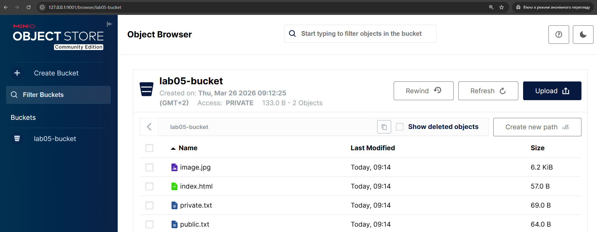

### Крок 3. Налаштування прав доступу (MinIO)

```powershell
# Зробити файл public.txt публічним
mc anonymous set download myminio/lab05-bucket/public.txt

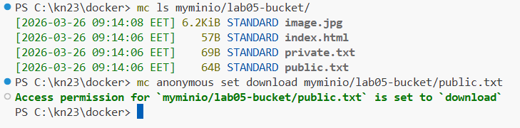

# Перевірте доступ (без авторизації):
Invoke-RestMethod -Uri "http://localhost:9000/lab05-bucket/public.txt"
```

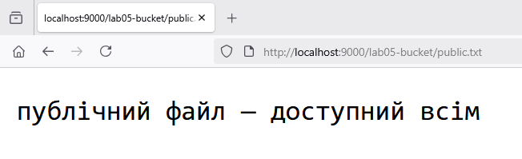

Якщо спробувати отримати доступ до приватного файлу, то маємо отримати помилку:

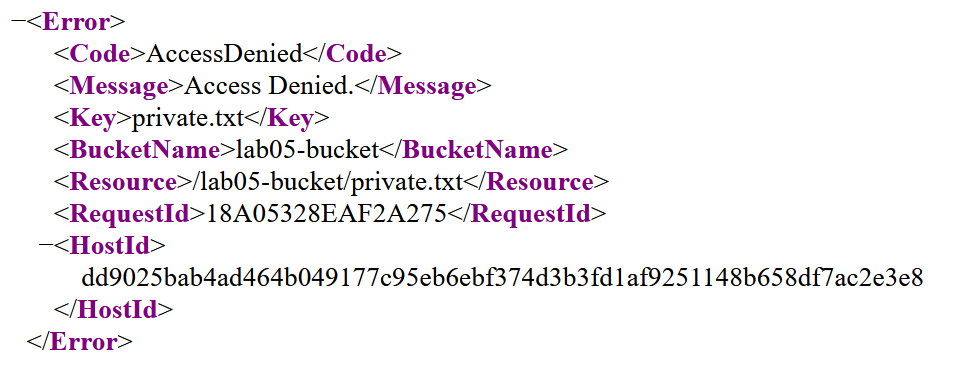

Відкрийте в браузері **MinIO Console** (`http://localhost:9001`), авторизуйтесь (`admin` / `password`) та перевірте наявність файлів.

### Крок 4. Версіонування об'єктів (MinIO)

```powershell
# Завантажити нові версії
"верс. 2 — оновлений файл" | Out-File -Encoding utf8 public.txt
mc cp public.txt myminio/lab05-bucket/

"верс. 3 — ще одне оновлення" | Out-File -Encoding utf8 public.txt
mc cp public.txt myminio/lab05-bucket/

# Переглянути всі версії об'єкта
mc ls --versions myminio/lab05-bucket/public.txt

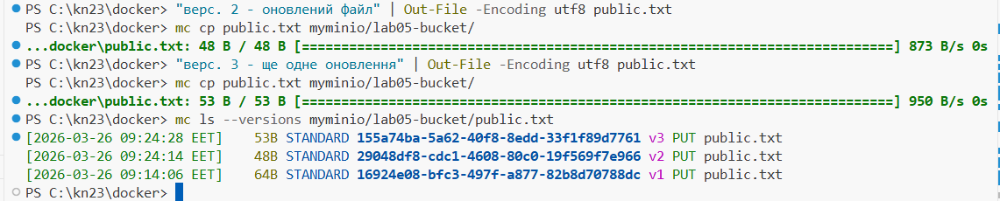

# Відновлення конкретної версії: скопіюйте VERSION_ID з попередньої команди
mc cp --version-id <VERSION_ID> myminio/lab05-bucket/public.txt restored.txt
Get-Content restored.txt
```

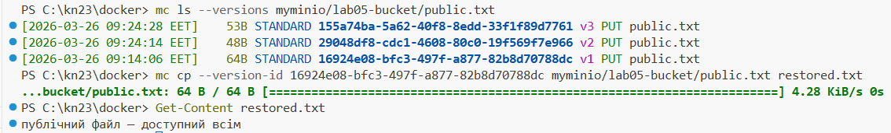

Також в папці з'явиться файл restored.txt

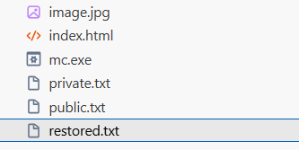

### Крок 5. Налаштування Lifecycle Policy (MinIO)

Налаштуємо автоматичне видалення об'єктів через 30 днів:

```powershell
# Створіть файл політики
@"
{
    "Rules": [
        {
            "Expiration": {
                "Days": 30
            },
            "ID": "auto-expire",
            "NoncurrentVersionExpiration": {
                "NoncurrentDays": 7
            },
            "Status": "Enabled"
        }
    ]
}
"@ | Out-File ilm.json -Encoding ascii

Ця команда створить файл ilm.json в поточній папці

# Застосуйте політику до кошика (в PowerShell використовуємо cmd /c для перенаправлення)
cmd /c "mc ilm import myminio/lab05-bucket < ilm.json"

Ця команда застосує політику до кошика lab05-bucket. Тепер через 30 днів всі файли будуть автоматично видалені.

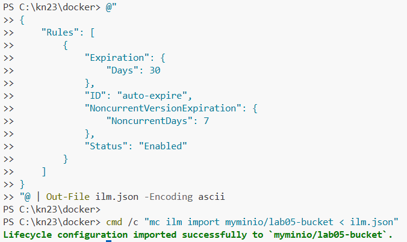

# Перевірте застосування
.\mc ilm ls myminio/lab05-bucket
```

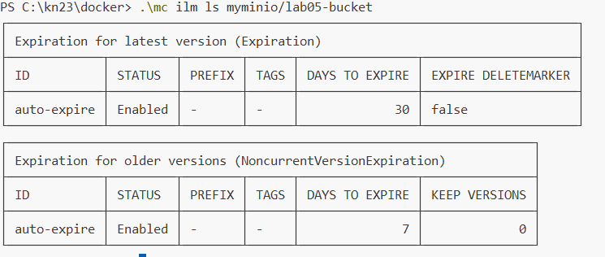

### Крок 6. Підключення Block Volume (Вбудований віртуальний диск VHD)

Замість лінуксового Block Volume ми створимо віртуальний жорсткий диск (VHD) вбудованими засобами Windows, що ідеально імітує підключення блочного накопичувача.

```powershell
# Запустіть утиліту diskpart (запитає згоду Адміністратора):
diskpart

# У відкритій консолі diskpart (виклик DISKPART>) виконайте команди по черзі:
create vdisk file="C:\virtual_drive.vhd" maximum=1024 type=expandable
select vdisk file="C:\virtual_drive.vhd"
attach vdisk
create partition primary
format fs=ntfs quick label="LabBlockVol"
assign letter=V
exit

# Поверніться у звичайний PowerShell та перевірте:
Get-Volume -DriveLetter V
"Local Block Storage Test" | Out-File -Encoding utf8 "V:\test.txt"
Get-ChildItem V:\
```

_(Альтернативний спосіб через інтерфейс: Натисніть `Win+X` -> `Керування дисками`. Оберіть меню `Дія` -> `Створити віртуальний жорсткий диск (VHD)`. Після створення диска у списку внизу, натисніть на нього "Ініціалізувати диск", а потім на нерозподіленому просторі — "Створити простий том" і пройдіть майстер форматування)._

### Крок 7. Порівняння вартості зберігання

У випадку локального розгортання вартість хмарного зберігання дорівнює **$0**, але ви використовуєте власні апаратні ресурси машини (пам'ять, CPU та дисковий простір Windows).

### Висновок.

У ході виконання Варіанта 2 було успішно реалізовано локальний робочий процес для роботи з хмарними технологіями зберігання даних. Ми розгорнули власне S3-сумісне сховище за допомогою Docker та MinIO, налаштували версіонування та політики життєвого циклу об'єктів (ILM). Також, замість фізичного хмарного блочного тому, ми використали віртуальний жорсткий диск (VHD) в ОС Windows, що дозволило на практиці відпрацювати ініціалізацію, форматування та монтування нових дискових ресурсів до системи. Дана конфігурація дозволяє отримати повний спектр практичного досвіду без залежності від доступності безкоштовних лімітів у провайдерів Oracle Cloud чи AWS.

## Варіант 3. [Backblaze B2 (Хмарне S3-сумісне сховище)](https://www.backblaze.com/)

Backblaze B2 — це надійне хмарне сховище, яке пропонує **10 GB безкоштовно** без обмеження по часу (Always Free) і зазвичай не потребує кредитної картки для старту.

### Крок 1. Реєстрація та створення Bucket

1. Зареєструйтесь на [backblaze.com](https://www.backblaze.com/b2/cloud-storage.html).
2. Перейдіть у розділ **B2 Cloud Storage** -> **Buckets**.
3. Натисніть **Create a Bucket**:
   - **Bucket Name:** `lab05-b2-<ваш-логін>` (має бути унікальним).
   - **Bucket Privacy:** `Private` (ми зробимо файл публічним пізніше).

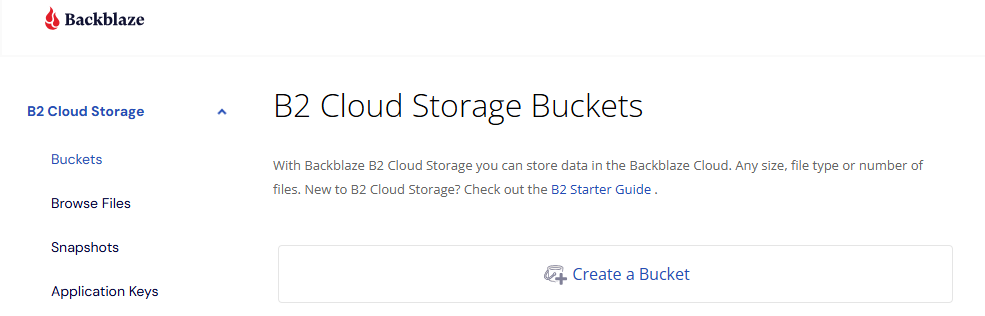

4. Після створення знайдіть **S3 Endpoint** для вашого бакета (наприклад, `s3.us-west-004.backblazeb2.com`).

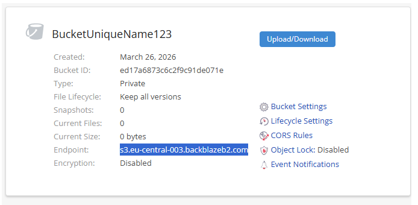

### Крок 2. Отримання ключів доступу (Application Keys)

1. Перейдіть у розділ [Account -> Application Keys](https://secure.backblaze.com/app_keys.htm).
2. Натисніть **Add a New Application Key**:
   - **Allow Access to Bucket(s):** Оберіть свій бакет.
   - **Type of Access:** `Read and Write`.
3. Скопіюйте `keyID` та `applicationKey`.

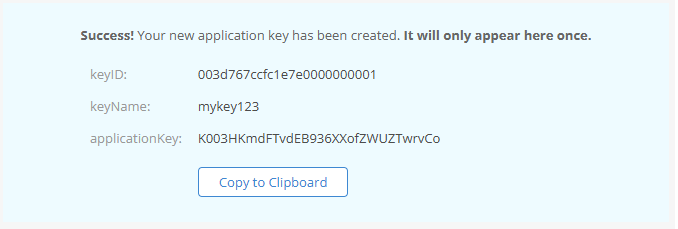

### Крок 3. Налаштування CLI та завантаження файлів

Використовуйте **AWS CLI**, вказавши кастомний endpoint.

```powershell
# 1. Налаштуйте ключі (keyID -> Access Key, applicationKey -> Secret Key)
# Важливо: Якщо ви отримуєте "Malformed Access Key Id", перевірте, чи не встановлені
# змінні оточення AWS_ACCESS_KEY_ID (наприклад, командою: $env:AWS_ACCESS_KEY_ID = $null)
aws configure

# 2. Створіть файл для завантаження
"Hello Backblaze" | Out-File -FilePath public.txt -Encoding ascii

# 3. Завантаження (змініть Endpoint та Bucket на власні з Кроку 1)
# Важливо: Endpoint обов'язково має починатися з https://
$ENDPOINT = "https://s3.us-west-004.backblazeb2.com"
$BUCKET = "lab05-b2-<ваш-логін>"

# Рекомендується додавати --region, що відповідає частині вашого endpoint (наприклад, us-west-004)
aws s3 cp public.txt s3://$BUCKET/ --endpoint-url $ENDPOINT --region us-west-004
aws s3 ls s3://$BUCKET/ --endpoint-url $ENDPOINT --region us-west-004
```

Тепер файл доступний за посиланням: [https://secure.backblaze.com/b2_browse_files2.htm](https://secure.backblaze.com/b2_browse_files2.htm)

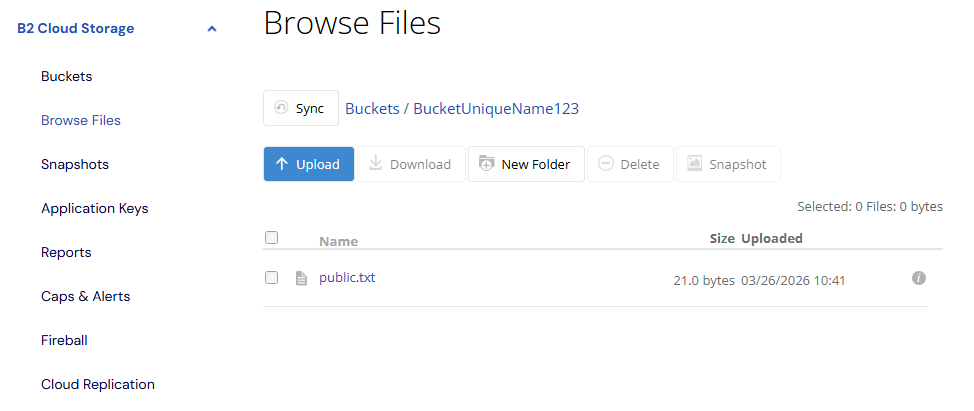

### Крок 4. Налаштування публічного доступу

1. У консолі B2 оберіть **Browse Files**.
2. Натисніть на іконку (i) біля `public.txt`.
3. Використовуйте **Friendly URL** для перевірки доступу через браузер.

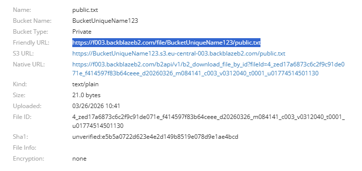

### Крок 5. Версіонування та Lifecycle

Backblaze підтримує версіонування автоматично. Для налаштування правил видалення перейдіть у **Lifecycle Settings** бакета та встановіть правила очищення старих версій через 7 днів.

---

### Крок 6. Підключення Block Volume (Локальна імітація)

Оскільки B2 — це виключно об'єктне сховище, для виконання цієї частини лабораторної використовуйте інструкції з **Варіанта 2 (Крок 6)** — створення віртуального диска VHD.

---

### Висновок до Варіанта 3.

Цей варіант демонструє гнучкість стандарту S3, що дозволяє використовувати хмарні ресурси різних провайдерів з тими самими інструментами (AWS CLI), уникаючи при цьому складних лімітів великих платформ.

---

## Контрольні запитання

1. Чим відрізняється об'єктне (Object Storage), блочне (Block Storage) та файлове (File Storage) сховище? Коли який тип доцільно використовувати?
2. Що таке версіонування об'єктів у S3? Як воно захищає від випадкового видалення файлів?
3. Що таке Lifecycle Policy? Наведіть практичний приклад її застосування для оптимізації витрат.
4. Що таке Pre-Authenticated Request (PAR) або Presigned URL? Для чого вони використовуються?
5. Поясніть різницю між Storage Class у AWS S3: Standard, Intelligent-Tiering, Glacier. Як вибрати оптимальний?
6. Чому при видаленні VM блочний том (Block Volume) може зберегтись окремо? Що таке «detach» та «terminate»?
7. У чому полягає різниця між хмарним S3-сховищем та локальним MinIO? Які переваги та недоліки розгортання власного S3-сумісного сховища?
8. Як віртуальний жорсткий диск (VHD) в ОС Windows імітує роботу хмарного Block Volume під час локальної розробки?
9. У чому особливість налаштування доступу у Backblaze B2? Чому рекомендується створювати окремий Application Key для кожного бакета?

---

## Вимоги до звіту

1. Скриншот списку об'єктів у кошику після завантаження всіх файлів (Cloud Console, B2 Console або MinIO Browser / `mc ls`)
2. Посилання на публічний об'єкт та скриншот його відкриття в браузері (S3 URL, Friendly URL у B2 або `http://localhost:9000/...`)
3. Вивід команди перегляду версій об'єкта: мінімум 3 версії (`aws s3api list-object-versions` або `mc ls --versions`)
4. Скриншот налаштованої Lifecycle Policy (Management Console, B2 Lifecycle або вивід `mc ilm ls`)
5. Підтвердження підключення блочного сховища (вивід `lsblk`/`df -h` для Linux або `Get-Volume`/`diskpart` для Windows VHD)
6. Відповіді на контрольні запитання у файлі `lab05.md`
7. Посилання на GitHub надіслати в Classroom
