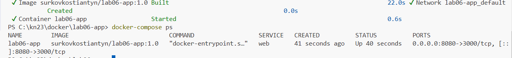
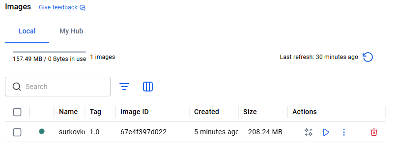
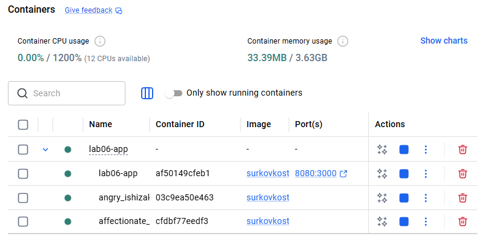

# Лабораторна робота №6 (2 години)

**Тема:** Контейнеризація застосунків за допомогою Docker.

Написання Dockerfile для простого веб-застосунку; збірка та тестування Docker-образу; публікація образу у хмарний реєстр контейнерів; запуск контейнера на хмарній VM.

**Мета:** Набути практичні навички контейнеризації застосунків: написання Dockerfile, збірка образу, локальне тестування, публікація до реєстру та запуск контейнера у хмарному середовищі.

**Технологічний стек:**

- **Docker Engine** (локально) або **Docker Desktop** (Windows/macOS)
- **Node.js / Python** — мова для простого веб-застосунку
- **Docker Hub** — безкоштовний публічний реєстр контейнерів
- **VM з Лабораторної №4** — для запуску контейнера у хмарі

---

## Завдання

1. Встановити Docker та перевірити його роботу
2. Написати простий веб-застосунок та Dockerfile для нього
3. Зібрати Docker-образ та запустити контейнер локально
4. Оптимізувати Dockerfile (multi-stage build або інструкція `.dockerignore`)
5. Опублікувати образ до Docker Hub
6. Завантажити та запустити образ на хмарній VM

---

## Хід виконання роботи

### Крок 1. Встановлення Docker

**Windows / macOS:**

- Завантажте та встановіть [Docker Desktop](https://www.docker.com/products/docker-desktop)
- Після запуску: у системному треї з'явиться іконка Docker

**Linux (Ubuntu):**

```bash
sudo apt update
sudo apt install -y ca-certificates curl gnupg
sudo install -m 0755 -d /etc/apt/keyrings
curl -fsSL https://download.docker.com/linux/ubuntu/gpg | sudo gpg --dearmor -o /etc/apt/keyrings/docker.gpg
echo "deb [arch=$(dpkg --print-architecture) signed-by=/etc/apt/keyrings/docker.gpg] https://download.docker.com/linux/ubuntu $(lsb_release -cs) stable" | sudo tee /etc/apt/sources.list.d/docker.list
sudo apt update && sudo apt install -y docker-ce docker-ce-cli containerd.io
sudo usermod -aG docker $USER  # Дозволити запуск без sudo
newgrp docker
```

Перевірка:

```bash
docker --version
docker run hello-world
```


### Крок 2. Написання веб-застосунку

Створіть директорію проєкту:

```bash
mkdir lab06-app
cd lab06-app
```


**Варіант А — Node.js:**

```bash
# package.json
cat > package.json << 'EOF'
{
  "name": "lab06-app",
  "version": "1.0.0",
  "main": "server.js",
  "scripts": { "start": "node server.js" },
  "dependencies": { "express": "^4.18.0" }
}
EOF

# server.js
cat > server.js << 'EOF'
const express = require('express');
const app = express();
const PORT = process.env.PORT || 3000;

app.get('/', (req, res) => {
  res.send(`
    <h1>🌩️ Cloud Lab 06 — Docker</h1>
    <p>Hostname: ${require('os').hostname()}</p>
    <p>Version: ${process.env.APP_VERSION || '1.0.0'}</p>
  `);
});

app.get('/health', (req, res) => res.json({ status: 'ok' }));

app.listen(PORT, () => console.log(`Server running on port ${PORT}`));
EOF
```

**Варіант Б — Python (Flask):**

```bash
cat > requirements.txt << 'EOF'
flask==3.0.0
EOF

cat > app.py << 'EOF'
import os
import socket
from flask import Flask

app = Flask(__name__)

@app.route('/')
def home():
    return f"""
    <h1>🌩️ Cloud Lab 06 — Docker</h1>
    <p>Hostname: {socket.gethostname()}</p>
    <p>Version: {os.environ.get('APP_VERSION', '1.0.0')}</p>
    """

@app.route('/health')
def health():
    return {'status': 'ok'}

if __name__ == '__main__':
    app.run(host='0.0.0.0', port=int(os.environ.get('PORT', 3000)))
EOF
```

### Крок 3. Написання Dockerfile

**Node.js Dockerfile:**

```dockerfile
# Dockerfile
FROM node:20-alpine

# Метадані
LABEL maintainer="lab06-student"
LABEL version="1.0"

# Робоча директорія
WORKDIR /app

# Копіювання залежностей окремо (кешування шарів)
COPY package*.json ./
RUN npm install --production

# Копіювання коду застосунку
COPY . .

# Відкриття порту
EXPOSE 3000

# Змінна оточення
ENV APP_VERSION=1.0.0
ENV NODE_ENV=production

# Команда запуску
CMD ["node", "server.js"]
```

**Python Dockerfile:**

```dockerfile
FROM python:3.12-slim

WORKDIR /app

COPY requirements.txt .
RUN pip install --no-cache-dir -r requirements.txt

COPY . .

EXPOSE 3000
ENV APP_VERSION=1.0.0

CMD ["python", "app.py"]
```

Створіть `.dockerignore`:

```
node_modules
.git
*.md
.env
__pycache__
*.pyc
```

Тепер структура файлів має виглядаити наступним чином:

```text
lab06-app/
├── Dockerfile
├── .dockerignore
├── package.json   (або requirements.txt)
├── server.js      (або app.py)
└── docker-compose.yml
```

### Крок 4. Збірка та локальне тестування

Для зручності запуску ми використаємо **Docker Compose** — інструмент для визначення та керування Docker-контейнерами. Замість того, щоб вводити довгі команди `docker build` та `docker run` кожного разу вручну, ми опишемо всі параметри (порти, змінні оточення, теги образів) у декларативному конфігураційному файлі `docker-compose.yml`.

1. **Створіть файл `docker-compose.yml` у директорії проєкту:**

```yaml
services:
  web:
    build: .
    image: <username>/lab06-app:1.0
    container_name: lab06-app
    ports:
      - "8080:3000"
    environment:
      - APP_VERSION=1.0.0
    restart: always
```

2. **Запустіть застосунок за допомогою Compose:**

```bash
# Збірка образу та запуск контейнера у фоновому режимі (-d)
docker-compose up -d

# Перегляд статусу запущених контейнерів
docker-compose ps
```

В разі успіху в терміналі з'явиться інформація про запущений контейнер:



В інтерфейсі Docker Desktop також буде видно створений образ:



В інтерфейсі Docker Desktop також буде видно запущений контейнер:



3. **Перевірте роботу застосунку:**

```bash
# Тестування через curl (або відкрийте http://localhost:8080 у браузері)
curl http://localhost:8080
curl http://localhost:8080/health

# Перегляд логів роботи (Ctrl+C для виходу)
docker-compose logs -f
```

4. **Корисні команди для керування:**

```bash
# Вхід всередину контейнера для виконання команд
docker-compose exec web /bin/sh

# Зупинка та повне видалення контейнерів і віртуальних мереж
docker-compose down
```

### Крок 5. Публікація образу до Docker Hub

```bash
# Реєстрація на https://hub.docker.com (якщо ще немає)
# Вхід у Docker Hub
docker login

# Тегування та публікація
docker push <username>/lab06-app:1.0

# Також позначте як latest
docker tag <username>/lab06-app:1.0 <username>/lab06-app:latest
docker push <username>/lab06-app:latest
```

Перевірте: відкрийте `https://hub.docker.com/r/<username>/lab06-app` у браузері.

### Крок 6. Запуск контейнера на хмарній VM

Підключіться до VM з Лабораторної №4:

```bash
ssh -i ~/.ssh/lab04_key ubuntu@<PUBLIC_IP>
```

На VM встановіть Docker та запустіть ваш контейнер:

```bash
# Встановлення Docker на VM
curl -fsSL https://get.docker.com | sudo bash
sudo usermod -aG docker ubuntu
newgrp docker

# Завантаження вашого образу з Docker Hub
docker pull <username>/lab06-app:latest

# Запуск
docker run -d \
  --name lab06-cloud \
  -p 80:3000 \
  --restart=unless-stopped \
  <username>/lab06-app:latest

docker ps
```

У Security List / Security Group відкрийте порт 80, потім відкрийте у браузері: `http://<PUBLIC_IP_VM>`.

---

## Контрольні запитання

1. Що таке Docker-образ та Docker-контейнер? У чому полягає різниця між ними?
2. Що таке шар (layer) у Docker-образі? Як структура Dockerfile впливає на розмір образу та ефективність кешування?
3. Поясніть призначення команд `COPY`, `RUN`, `CMD`, `ENTRYPOINT`, `ENV` у Dockerfile.
4. Що таке `.dockerignore`? Які файли слід додавати до нього та чому?
5. Чим відрізняється `docker stop` від `docker kill`? Що відбувається з процесами всередині контейнера?
6. Що таке multi-stage build у Docker? Для чого він використовується та як зменшує розмір фінального образу?

---

## Вимоги до звіту

1. Вміст написаного `Dockerfile`
2. Вивід команди `docker images` з вашим образом та його розміром
3. Скриншот браузера з запущеним застосунком локально (`localhost:8080`)
4. Посилання на ваш образ на Docker Hub
5. Скриншот браузера з запущеним застосунком на хмарній VM (публічна IP)
6. Відповіді на контрольні запитання у файлі `lab06.md`
7. Посилання на GitHub-репозиторій з кодом та Dockerfile надіслати в Classroom
