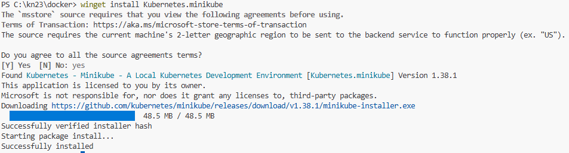
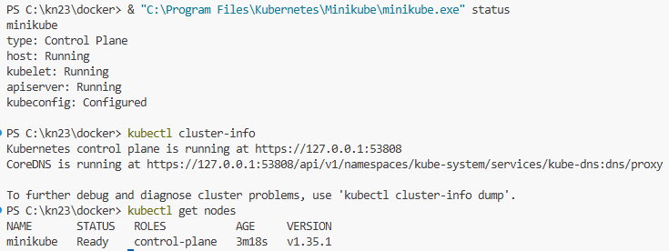
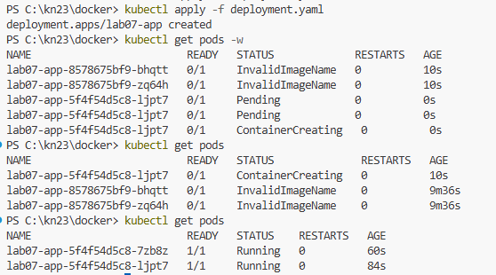
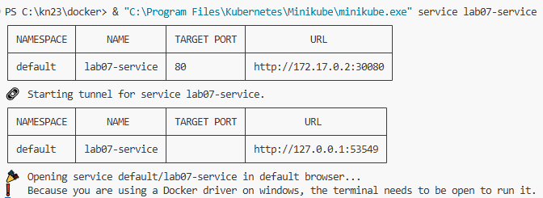
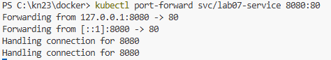
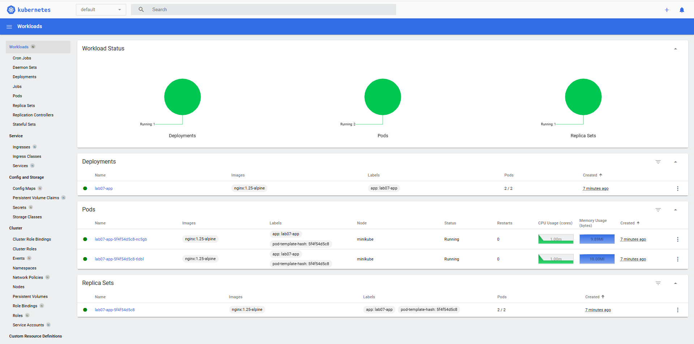
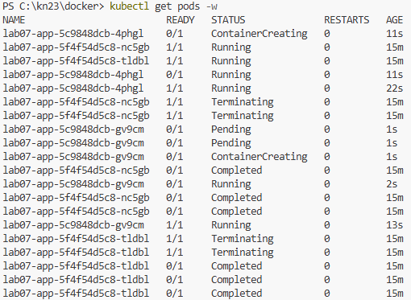
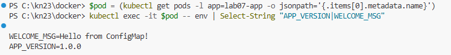

# Лабораторна робота №7 (2 години)

**Тема:** Оркестрація контейнерів у Kubernetes.

Розгортання Kubernetes-кластера (локально або в хмарі); опис розгортання у YAML-маніфестах (Deployment, Service, ConfigMap); масштабування подів та налаштування Horizontal Pod Autoscaler; оновлення застосунку без простою (Rolling Update).

**Мета:** Набути практичні навички розгортання контейнеризованих застосунків у Kubernetes, роботи з YAML-маніфестами, масштабування та виконання оновлень без простою сервісу.

**Технологічний стек:**

- **Minikube** або **kind** — локальний Kubernetes-кластер (рекомендовано для початку)
- **kubectl** — CLI-інструмент для управління Kubernetes
- **Docker** — для роботи з образами (або вже існуючий образ з Лаб. №6)
- **Kubernetes Playground** (альтернатива) — [play-with-k8s.com](https://labs.play-with-k8s.com/)

---

## Завдання

1. Встановити kubectl та розгорнути локальний кластер за допомогою Minikube
2. Розгорнути застосунок за допомогою YAML-маніфесту (Deployment)
3. Створити Service для доступу до застосунку
4. Масштабувати Deployment (збільшити кількість реплік)
5. Виконати Rolling Update (оновлення без простою)
6. Налаштувати ConfigMap та використати його у Pod'і

---

## Хід виконання роботи

### Крок 1. Встановлення kubectl та Minikube

**kubectl:**

```bash
# Linux
curl -LO "https://dl.k8s.io/release/$(curl -L -s https://dl.k8s.io/release/stable.txt)/bin/linux/amd64/kubectl"
sudo install -o root -g root -m 0755 kubectl /usr/local/bin/kubectl

# macOS (Homebrew)
brew install kubectl

# Windows (winget)
winget install Kubernetes.kubectl
# або Chocolatey: choco install kubernetes-cli
# або Scoop: scoop install kubectl

# Перевірка встановлення
kubectl version --client
```

**Примітка:** Якщо у вас встановлено **Docker Desktop**, `kubectl` зазвичай вже йде в комплекті, і додаткове встановлення не потрібне.

**Minikube** — це інструмент, який створює локальний Kubernetes-кластер на вашому комп'ютері. Він запускає однонодовий кластер всередині віртуальної машини або контейнера, що ідеально підходить для тестування маніфестів.

**Системні вимоги:**

- 2 або більше CPU.
- 2 ГБ вільної оперативної пам'яті (рекомендовано 4 ГБ+).
- 20 ГБ вільного місця на диску.
- Підтримка віртуалізації (має бути увімкнена в BIOS/UEFI).

**Встановлення:**

```bash
# Linux
curl -LO https://storage.googleapis.com/minikube/releases/latest/minikube-linux-amd64
sudo install minikube-linux-amd64 /usr/local/bin/minikube

# macOS (Homebrew)
brew install minikube

# Windows (winget - рекомендовано)
winget install Kubernetes.minikube
# або Chocolatey:
choco install minikube
```



```bash
# Перевірка статусу
minikube status
```

> [!IMPORTANT]
> Після встановлення обов'язково **перезавантажте термінал**, щоб система побачила нові змінні оточення (PATH).
>
> Якщо ви не хочете перезавантажувати термінал або команда `minikube` не розпізнається, виконайте ці команди в PowerShell (це оновить шлях для поточної сесії та запустить кластер):
>
> ```powershell
> $env:Path += ";C:\Program Files\Kubernetes\Minikube"
> & "C:\Program Files\Kubernetes\Minikube\minikube.exe" start --driver=docker --cpus=2 --memory=2g
> ```

### Крок 2. П’ятнадцятихвилинний старт (Запуск кластера)

Для запуску ми використовуємо драйвер `docker`, оскільки він найшвидший і не потребує складної конфігурації віртуальних машин.

```bash
# Запуск кластера з обмеженням ресурсів
minikube start --driver=docker --cpus=2 --memory=2g

# Перевірка статусу
minikube status

# Перевірка
kubectl cluster-info
kubectl get nodes
minikube dashboard   # Відкриває веб-UI
```

> [!TIP]
> Для того, щоб у Dashboard відображалися графіки використання ресурсів (CPU, RAM), необхідно увімкнути аддон **metrics-server**:
>
> ```bash
> minikube addons enable metrics-server
> ```



### Крок 2. Перший YAML-маніфест — Deployment

Створіть файл `deployment.yaml`:

```yaml
apiVersion: apps/v1
kind: Deployment
metadata:
  name: lab07-app
  labels:
    app: lab07-app
spec:
  replicas: 2
  selector:
    matchLabels:
      app: lab07-app
  template:
    metadata:
      labels:
        app: lab07-app
    spec:
      containers:
        - name: app
          image: nginx:1.25-alpine
          ports:
            - containerPort: 80
          env:
            - name: APP_VERSION
              value: "1.0.0"
          resources:
            requests:
              memory: "64Mi"
              cpu: "50m"
            limits:
              memory: "128Mi"
              cpu: "200m"
          readinessProbe:
            httpGet:
              path: /
              port: 80
            initialDelaySeconds: 5
            periodSeconds: 10
```

Застосуйте маніфест:

```bash
kubectl apply -f deployment.yaml

# Слідкуйте за розгортанням
kubectl get pods -w
kubectl rollout status deployment/lab07-app

# Деталі Deployment
kubectl describe deployment lab07-app
```



### Крок 3. Створення Service

Створіть `service.yaml`:

```yaml
apiVersion: v1
kind: Service
metadata:
  name: lab07-service
spec:
  type: NodePort
  selector:
    app: lab07-app
  ports:
    - protocol: TCP
      port: 80 # порт Service
      targetPort: 80 # порт контейнера (змінено з 3000 на 80 для nginx)
      nodePort: 30080 # зовнішній порт вузла (30000–32767)
```

```bash
# Застосування конфігурації сервісу
kubectl apply -f service.yaml

# Перевірка статусу сервісів (отремання IP та портів)
kubectl get svc

# Відкриття застосунку у браузері через Minikube (використовуємо повний шлях, якщо minikube не у PATH)
& "C:\Program Files\Kubernetes\Minikube\minikube.exe" service lab07-service

# Альтернативний спосіб: прокидання порту (Port Forwarding)
# Дозволяє звернутися до сервісу через localhost:8080
kubectl port-forward svc/lab07-service 8080:80
```

> [!NOTE]
> **Що виводить консоль?**
>
> 1. **minikube service**: Оскільки ви використовуєте драйвер `docker` на Windows, Minikube не може надати прямий доступ до IP вузла (NodePort) через мережеві обмеження Docker Desktop. Тому він запускає **тунель** (SSH-проксі). У консолі з'явиться таблиця, де в полі **URL** буде вказано адресу `http://127.0.0.1:XXXXX`. Саме цю адресу потрібно використовувати для доступу.
> 2. **kubectl port-forward**: Команда створює прямий тунель між вашим локальний портом `8080` та портом сервісу `80` всередині кластера. Вивід `Forwarding from 127.0.0.1:8080 -> 80` означає, що тепер застосунок доступний за адресою `http://localhost:8080`.





Тепер відкриваємо Dashboard і бачимо наш кластер

```bash
& "C:\Program Files\Kubernetes\Minikube\minikube.exe" dashboard
```



На дашборді ми бачимо стан наших робочих навантажень (**Workloads**):

- **Deployments**: відображається створений нами `lab07-app`, який має 2 активні репліки.
- **Pods**: перелічено два запущені поди з образом `nginx:1.25-alpine`. Також видно споживання ресурсів (CPU та RAM) для кожного пода.
- **Replica Sets**: контролер, який забезпечує підтримку заданої кількості реплік (2/2).

Всі індикатори зелені, що підтверджує стабільну роботу застосунку в кластері.

### Крок 4. Базові команди kubectl

```bash
# Pods
kubectl get pods
kubectl get pods -o wide       # З IP та нодою
kubectl describe pod <pod-name>
kubectl logs <pod-name>
kubectl exec -it <pod-name> -- /bin/sh    # Вхід у Pod

# Deployments
kubectl get deployments
kubectl get deploy lab07-app -o yaml      # Повний YAML

# Services
kubectl get services
kubectl get all                            # Всі ресурси
```

### Крок 5. Масштабування

```bash
# Збільшити кількість реплік до 4
kubectl scale deployment lab07-app --replicas=4
```

Перевірте зміни в Dashboard або за допомогою команди

```bash
# Спостерігати за появою нових подів
kubectl get pods -w
```

```bash
# Зменшити до 1
kubectl scale deployment lab07-app --replicas=1

# Перевірити розподіл навантаження (кожен запит може йти до різного пода)
for i in {1..5}; do curl -s $(minikube service lab07-service --url) | grep Hostname; done
```

### Крок 6. Rolling Update (оновлення без простою)

**Rolling Update** — це стратегія оновлення, при якій Kubernetes поступово замінює старі Поди на нові. Це дозволяє оновити застосунок без припинення обслуговування користувачів.

1. Відкрийте файл `deployment.yaml` та змініть тег образу (наприклад, на новішу версію nginx):

```yaml
containers:
  - name: app
    image: nginx:1.27-alpine # було 1.25-alpine
```

2. Застосуйте оновлену конфігурацію:

```bash
kubectl apply -f deployment.yaml

# Спостерігайте за процесом за допомогою Dashboard або команди:
kubectl get pods -w



# Перевірка статусу завершення оновлення
kubectl rollout status deployment/lab07-app

# Перегляд історії оновлень кластера
kubectl rollout history deployment/lab07-app
```

3. Якщо під час оновлення щось пішло не так, ви можете миттєво відкотитися до попередньої стабільної версії:

```bash
kubectl rollout undo deployment/lab07-app
```

### Крок 7. ConfigMap (Налаштування змінних оточення)

**ConfigMap** — це об'єкт Kubernetes, який дозволяє зберігати конфігураційні дані (змінні оточення, файли налаштувань) окремо від образу контейнера.

1. Створіть файл `configmap.yaml` із параметрами вашого застосунку:

```yaml
apiVersion: v1
kind: ConfigMap
metadata:
  name: lab07-config
data:
  APP_VERSION: "2.0.0"
  LOG_LEVEL: "info"
  WELCOME_MSG: "Hello from ConfigMap!"
```

2. Оновіть `deployment.yaml`. **Важливо:** секція `envFrom` має знаходитися всередині `containers` (на тому ж рівні, що й `image` чи `ports`):

```yaml
spec:
  containers:
    - name: app
      image: nginx:1.27-alpine
      ports:
        - containerPort: 80
      # ... інші налаштування ...
      envFrom:
        - configMapRef:
            name: lab07-config
```

3. Застосуйте конфігурацію та виконайте перевірку:

```bash
# 1. Створити ConfigMap у кластері
kubectl apply -f configmap.yaml

# 2. Оновити Deployment
kubectl apply -f deployment.yaml

# 3. Перевірити, що змінні успішно передані в Pod
# Для Linux/macOS (Bash):
kubectl exec -it $(kubectl get pods -l app=lab07-app -o jsonpath='{.items[0].metadata.name}') -- env | grep -E "APP_VERSION|WELCOME_MSG"

# Для Windows (PowerShell):
$pod = (kubectl get pods -l app=lab07-app -o jsonpath='{.items[0].metadata.name}')
kubectl exec -it $pod -- env | Select-String "APP_VERSION|WELCOME_MSG"
```



---

## Контрольні запитання

1. Що таке Pod у Kubernetes? Чому Pod може містити кілька контейнерів?
2. Поясніть призначення Deployment у Kubernetes. Чим він відрізняється від простого запуску Pod'а?
3. Які типи Service існують у Kubernetes (ClusterIP, NodePort, LoadBalancer)? Коли який використовується?
4. Що таке Rolling Update? Як Kubernetes забезпечує відсутність простою сервісу під час оновлення?
5. Що таке ConfigMap та Secret у Kubernetes? Чому секрети не варто зберігати у ConfigMap?
6. Що таке Horizontal Pod Autoscaler (HPA)? На основі яких метрик він масштабує Deployment?

---

## Вимоги до звіту

1. Вміст файлів `deployment.yaml` та `service.yaml`
2. Вивід `kubectl get pods -o wide` після розгортання (2 репліки)
3. Скриншот браузера з відкритим застосунком через Minikube
4. Вивід `kubectl get pods` до та після масштабування (1→4→1 репліки)
5. Вивід `kubectl rollout history deployment/lab07-app`
6. Відповіді на контрольні запитання у файлі `lab07.md`
7. Посилання на GitHub з YAML-маніфестами надіслати в Classroom
