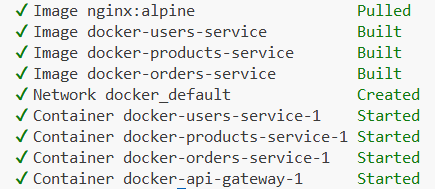
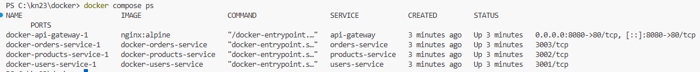
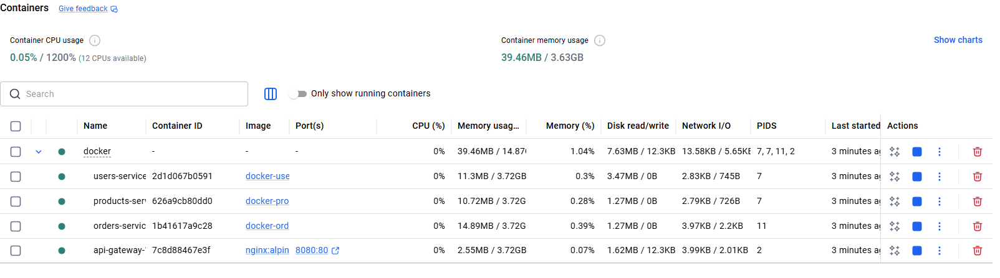

# Лабораторна робота №12 (2 години)

**Тема:** Проєктування та розгортання мікросервісної архітектури.

Декомпозиція застосунку на мікросервіси; налаштування API Gateway; міжсервісна комунікація через REST; розгортання сервісів у окремих контейнерах.

**Мета:** Набути практичні навички декомпозиції монолітного застосунку на мікросервіси, налаштування маршрутизації між ними через API-шлюз та розгортання конфігурації через Docker Compose.

**Технологічний стек:**

- **Docker Compose** — для локального запуску кількох сервісів
- **Node.js / Express** — мова реалізації мікросервісів
- **Nginx** — як API Gateway / Reverse Proxy
- **Railway** або **Render** — для хмарного деплою (опціонально)

## Завдання

1. Розбити простий застосунок на 3 мікросервіси (users, products, orders)
2. Написати Docker Compose конфігурацію для запуску всіх сервісів
3. Налаштувати Nginx як API Gateway з маршрутизацією
4. Виконати тестування міжсервісної комунікації
5. Дослідити переваги та проблеми мікросервісного підходу

## Хід виконання роботи

## 1. Створення структури проєкту

### Крок 1. Структура проєкту

```
lab12-microservices/
├── users-service/
│   ├── server.js
│   ├── package.json
│   └── Dockerfile
├── products-service/
│   ├── server.js
│   ├── package.json
│   └── Dockerfile
├── orders-service/
│   ├── server.js
│   ├── package.json
│   └── Dockerfile
├── nginx/
│   └── nginx.conf
└── docker-compose.yml
```

```bash
mkdir lab12-microservices
cd lab12-microservices
mkdir users-service products-service orders-service nginx
```

Також файли можна взяти тут:

[Lab 12](https://github.com/SurkovKostiantyn/nmk/tree/master/cloud_technologies/projects/lab_12_start_project) — Мікросервісна архітектура (Microservices)

### Крок 2. Users Service

```js
// users-service/server.js
const express = require("express");
const app = express();
app.use(express.json());

const users = [
  { id: 1, name: "Іван Петренко", email: "ivan@example.com" },
  { id: 2, name: "Марія Коваленко", email: "maria@example.com" },
];

app.get("/users", (req, res) => res.json(users));
app.get("/users/:id", (req, res) => {
  const user = users.find((u) => u.id === parseInt(req.params.id));
  user ? res.json(user) : res.status(404).json({ error: "User not found" });
});

app.listen(3001, () => console.log("Users Service on port 3001"));
```

```json
// users-service/package.json
{
  "name": "users-service",
  "version": "1.0.0",
  "main": "server.js",
  "scripts": { "start": "node server.js" },
  "dependencies": { "express": "^4.18.0" }
}
```

```dockerfile
# users-service/Dockerfile
FROM node:20-alpine
WORKDIR /app
COPY package*.json ./
RUN npm install --production
COPY . .
EXPOSE 3001
CMD ["node", "server.js"]
```

### Крок 3. Products Service

```js
// products-service/server.js
const express = require("express");
const app = express();
app.use(express.json());

const products = [
  { id: 1, name: "Ноутбук", price: 30000, stock: 10 },
  { id: 2, name: "Мишка", price: 500, stock: 50 },
  { id: 3, name: "Клавіатура", price: 1200, stock: 30 },
];

app.get("/products", (req, res) => res.json(products));
app.get("/products/:id", (req, res) => {
  const product = products.find((p) => p.id === parseInt(req.params.id));
  product
    ? res.json(product)
    : res.status(404).json({ error: "Product not found" });
});

app.listen(3002, () => console.log("Products Service on port 3002"));
```

_(Dockerfile аналогічний, порт 3002)_

### Крок 4. Orders Service (з міжсервісною комунікацією)

```js
// orders-service/server.js
const express = require("express");
const app = express();
app.use(express.json());

const USERS_URL = process.env.USERS_SERVICE_URL || "http://users-service:3001";
const PRODUCTS_URL =
  process.env.PRODUCTS_SERVICE_URL || "http://products-service:3002";

const orders = [];
let nextId = 1;

app.post("/orders", async (req, res) => {
  const { userId, productId } = req.body;
  try {
    // Перевірка існування користувача та продукту
    const [userRes, productRes] = await Promise.all([
      fetch(`${USERS_URL}/users/${userId}`),
      fetch(`${PRODUCTS_URL}/products/${productId}`),
    ]);

    if (!userRes.ok) return res.status(404).json({ error: "User not found" });
    if (!productRes.ok)
      return res.status(404).json({ error: "Product not found" });

    const [user, product] = await Promise.all([
      userRes.json(),
      productRes.json(),
    ]);

    const order = {
      id: nextId++,
      userId,
      productId,
      userName: user.name,
      productName: product.name,
      price: product.price,
      createdAt: new Date().toISOString(),
    };
    orders.push(order);
    res.status(201).json(order);
  } catch (err) {
    res.status(500).json({ error: err.message });
  }
});

app.get("/orders", (req, res) => res.json(orders));

app.listen(3003, () => console.log("Orders Service on port 3003"));
```

_(Dockerfile аналогічний, порт 3003)_

### Крок 5. Nginx як API Gateway

```nginx
# nginx/nginx.conf
events {}

http {
    upstream users {  server users-service:3001; }
    upstream products { server products-service:3002; }
    upstream orders { server orders-service:3003; }

    server {
        listen 80;

        location /api/users {
            proxy_pass http://users;
            rewrite ^/api/users(.*)$ /users$1 break;
        }

        location /api/products {
            proxy_pass http://products;
            rewrite ^/api/products(.*)$ /products$1 break;
        }

        location /api/orders {
            proxy_pass http://orders;
            rewrite ^/api/orders(.*)$ /orders$1 break;
        }

        location / {
            return 200 '{"services": ["/api/users", "/api/products", "/api/orders"]}';
            add_header Content-Type application/json;
        }
    }
}
```

### Крок 6. Docker Compose

```yaml
# docker-compose.yml
services:
  users-service:
    build: ./users-service
    expose: [3001]
    restart: unless-stopped

  products-service:
    build: ./products-service
    expose: [3002]
    restart: unless-stopped

  orders-service:
    build: ./orders-service
    expose: [3003]
    environment:
      - USERS_SERVICE_URL=http://users-service:3001
      - PRODUCTS_SERVICE_URL=http://products-service:3002
    depends_on: [users-service, products-service]
    restart: unless-stopped

  api-gateway:
    image: nginx:alpine
    ports: ["8080:80"]
    volumes:
      - ./nginx/nginx.conf:/etc/nginx/nginx.conf:ro
    depends_on: [users-service, products-service, orders-service]
    restart: unless-stopped
```

## 2. Збірка, запуск, перевірка та зупинка (PowerShell)

### 1. Збірка та запуск

```powershell
docker compose up --build -d
```



### 2. Перевірка запуску сервісів

```powershell
docker compose ps
docker compose logs users-service
docker compose logs products-service
docker compose logs orders-service
docker compose logs api-gateway
```





### 3. Тестування через API Gateway

#### Запит 1: отримання користувачів

```powershell
curl http://localhost:8080/api/users
```

#### Приклад відповіді:

```
[{"id":1,"name":"Іван Петренко","email":"ivan@example.com"},{"id":2,"name":"Марія Коваленко","email":"maria@example.com"}]
```

#### Запит 2: отримання продуктів

```powershell
curl http://localhost:8080/api/products
```

#### Приклад відповіді:

```
[{"id":1,"name":"Ноутбук","price":30000,"stock":10},{"id":2,"name":"Мишка","price":500,"stock":50},{"id":3,"name":"Клавіатура","price":1200,"stock":30}]
```

#### Запит 3:

Якщо використовуєте PowerShell (потрібно екранувати подвійні лапки для curl.exe):

```powershell
curl.exe -X POST http://localhost:8080/api/orders -H "Content-Type: application/json" -d '{\"userId\": 1, \"productId\": 2}'
```

Або використовуючи рідну команду PowerShell:

```powershell
Invoke-RestMethod -Uri "http://localhost:8080/api/orders" -Method Post -ContentType "application/json" -Body '{"userId": 1, "productId": 2}'
```

#### Приклад відповіді:

```
id          : 3
userId      : 1
productId   : 2
userName    : Іван Петренко
productName : Мишка
price       : 500
createdAt   : 2026-05-07T06:11:23.909Z
```

### 4. Перевірити логи конкретного сервісу

```powershell
docker compose logs orders-service
```

### 5. Зупинка

```powershell
docker compose down
```

## 3. Деплоймент на хмару (Railway)

У цьому кроці ми розглянемо, як розгорнути нашу мікросервісну архітектуру у хмарі **Railway**. Оскільки Railway підтримує деплой безпосередньо з GitHub-репозиторію та автоматично збирає Docker-контейнери, процес є максимально простим.

### Крок 1. Створення Dockerfile для Nginx (API Gateway)

У локальній конфігурації Docker Compose ми монтували `nginx.conf` як том (`volume`). У хмарі це зробити важко, тому для Nginx потрібно створити окремий `Dockerfile` у папці `./nginx`:

Створіть файл `nginx/Dockerfile` з наступним вмістом:

```dockerfile
FROM nginx:alpine
COPY nginx.conf /etc/nginx/nginx.conf
EXPOSE 80
```

### Крок 2. Збереження змін у GitHub

Запушіть нові зміни до вашого репозиторію:

```powershell
git add .
git commit -m "add nginx dockerfile"
git push
```

### Крок 3. Налаштування проєкту в Railway

1. Перейдіть на [Railway.app](https://railway.app/) та авторизуйтеся за допомогою вашого GitHub-акаунту.
2. Натисніть **+ New Project** -> **Deploy from GitHub** та виберіть ваш репозиторій з лабораторною роботою.

### Крок 4. Створення та конфігурація сервісів

Оскільки наш проєкт є монорепозиторієм (містить кілька сервісів в одному репозиторії), нам потрібно створити окремий сервіс у Railway для кожного компонента.

Для цього натисніть **+ New** -> **GitHub** -> виберіть свій репозиторій для кожного з 4 сервісів і налаштуйте їх відповідно до таблиці:

| Сервіс (Service Name)  | Шлях до папки (Root Directory) | Порт (Port) | Змінні оточення (Variables)                                                                                                                    |
| :--------------------- | :----------------------------- | :---------- | :--------------------------------------------------------------------------------------------------------------------------------------------- |
| **`users-service`**    | `/users-service`               | `3001`      | —                                                                                                                                              |
| **`products-service`** | `/products-service`            | `3002`      | —                                                                                                                                              |
| **`orders-service`**   | `/orders-service`              | `3003`      | `USERS_SERVICE_URL` = `http://users-service.railway.internal:3001`<br>`PRODUCTS_SERVICE_URL` = `http://products-service.railway.internal:3002` |
| **`api-gateway`**      | `/nginx`                       | `80`        | —                                                                                                                                              |

> **Примітка:** Завдяки внутрішній мережі Railway (Private Networking), мікросервіси можуть комунікувати між собою за шаблоном `http://<service-name>.railway.internal:<port>`.

### Крок 5. Налаштування публічної адреси для API Gateway

Щоб мати можливість надсилати запити до нашого застосунку ззовні:

1. Перейдіть до сервісу **`api-gateway`** у проєкті Railway.
2. Перейдіть на вкладку **Settings**.
3. У розділі **Networking** натисніть **Generate Domain**.
4. Railway згенерує публічну адресу (наприклад, `https://api-gateway-production.up.railway.app`).

### Крок 6. Тестування хмарного деплою

Тепер ви можете перевірити працездатність застосунку, надсилаючи запити на вашу публічну адресу `api-gateway` замість `localhost:8080`:

```powershell
# Отримання користувачів
curl https://<your-gateway-domain>.up.railway.app/api/users

# Отримання продуктів
curl https://<your-gateway-domain>.up.railway.app/api/products

# Створення замовлення
Invoke-RestMethod -Uri "https://<your-gateway-domain>.up.railway.app/api/orders" -Method Post -ContentType "application/json" -Body '{"userId": 1, "productId": 2}'
```

## Контрольні запитання

1. Що таке мікросервісна архітектура? Перерахуйте її ключові переваги та недоліки порівняно з монолітом.
2. Що таке API Gateway? Які функції він виконує у мікросервісній архітектурі?
3. Що таке service discovery? Чому в Docker Compose сервіси знаходять один одного за іменем?
4. Що таке Circuit Breaker Pattern? Для вирішення якої проблеми мікросервісів він використовується?
5. Що таке eventual consistency? Чому підтримка транзакцій між мікросервісами є складнішою, ніж в моноліті?
6. Поясніть концепцію «12-factor app». Як вона пов'язана з хмарними застосунками?

## Вимоги до звіту

1. Скриншот `docker-compose ps` з усіма запущеними сервісами
2. Вивід `curl /api/users`, `curl /api/products`
3. Вивід після виконання POST `/api/orders` та GET `/api/orders`
4. Вміст файлу `docker-compose.yml` та `nginx/nginx.conf`
5. Діаграма архітектури (схема зв'язків між сервісами — текстова або малюнок)
6. Відповіді на контрольні запитання у файлі `lab12.md`
7. Посилання на GitHub-репозиторій надіслати в Classroom
