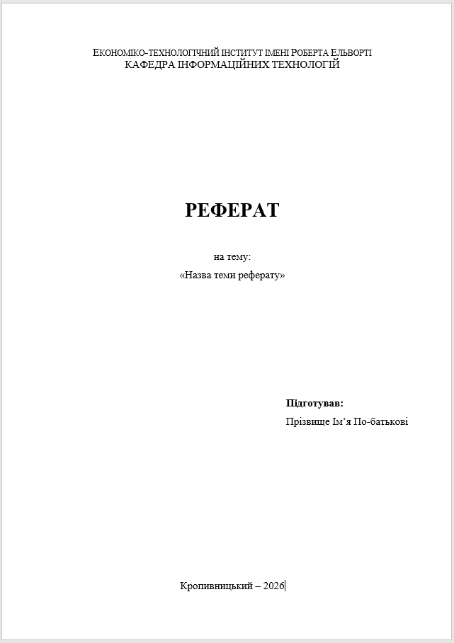
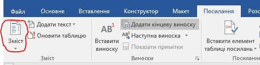
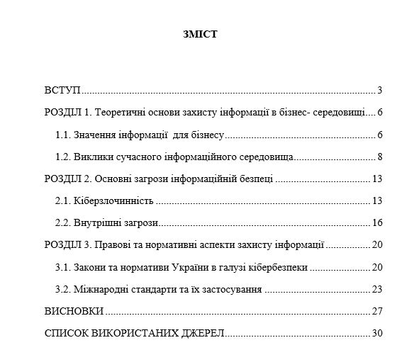
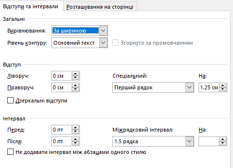
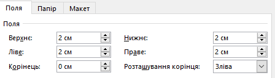
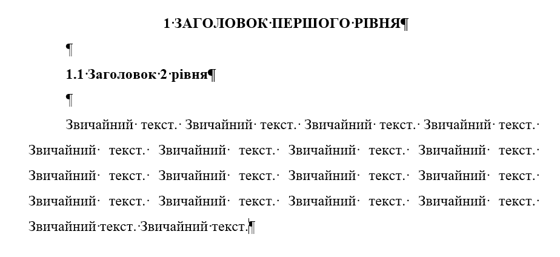

# Завдання на реферат з дисципліни "Хмарні технології"

## Загальна інформація

Реферат є формою самостійної роботи студента, спрямованою на глибоке вивчення конкретного аспекту хмарних обчислень. Робота має демонструвати здатність аналізувати сучасні технології, порівнювати рішення від різних вендорів та робити обґрунтовані висновки.

## Вимоги до оформлення

1.  **Обсяг:** 10-15 сторінок друкованого тексту.
2.  **Структура:**
    - Титульний аркуш:  
      
    - Зміст (має створюватись автоматично на основі заголовків першого та другого рівнів):  
      
      
    - Вступ:
      - актуальність теми;
      - мета роботи;
      - завдання роботи.
    - Основна частина (2-3 розділи):
      - має містити теоретичну частину.
      - має містити практичну частину.
    - Висновки (на основі поставлених у вступі завдань).
    - Список використаних джерел (не менше 5 джерел, виданих за останні 3-5 років; посилання оформлювати за ДСТУ 2015).
    - Додатки (за наявності).

3.  **Формат:**
    - файл у форматі .pdf або .docx;
    - шрифт Times New Roman, розмір 14pt;
    - міжрядковий інтервал 1.5;
    - відступ між абзацами 0 пт;
    - відступ першого рядка (абзацу) – 1.25 см:  
      
    - поля 20 мм з усіх сторін:  
      
    - вирівнювання тексту – за шириною;
    - нумерація сторінок – арабськими цифрами у правому верхньому куті сторінки;
    - титульний аркуш та зміст не нумеруються.
    - заголовки першого рівня починають з нової сторінки, великими літерами, напівжирним;
    - заголовки другого рівня починаються з нового рядка, малими літерами, напівжирним:  
      

## Вимоги до презентації

1. **Кількість слайдів** – 5-7.
2. **Стиль:** мінімалістичний, корпоративний (Office Theme або Clean).
3. **Дизайн:** світлий фон, чорний текст, використання корпоративних кольорів (синій, сірий, білий). Уникайте яскравих, кричущих кольорів та складних фонових зображень.
4. **Шрифти:** єдиний шрифт (наприклад, Segoe UI, Calibri) для заголовків та тексту.
5. **Слайди:**
   - титульний слайд: тема, автор, група, викладач;
   - мета та завдання роботи;
   - основна частина (теоретична та практична - за наявності);
   - висновки.

## Теми рефератів

1.  **Порівняльний аналіз моделей ціноутворення AWS та Microsoft Azure для стартапів.** (Аналіз вартості, безкоштовних рівнів та програм підтримки).
2.  **Географічне покриття та мережева інфраструктура "великої трійки" хмарних провайдерів.** (Порівняння регіонів, зон доступності та Edge-локацій).
3.  **Модель спільної відповідальності в хмарі. Розподіл обов'язків між провайдером та клієнтом.** (Аналіз безпеки на рівнях IaaS, PaaS та SaaS).
4.  **Аналіз галузевих стандартів безпеки (SOC 2, ISO 27001) та їх реалізація в хмарі.**
5.  **Стратегії Disaster Recovery у хмарі. Порівняння Cold, Warm та Hot Standby архітектур.**
6.  **Проєктування високонадійних (High Availability) систем. Стратегії Multi-AZ та Multi-Region.**
7.  **Terraform vs AWS CloudFormation: вибір інструменту для автоматизації хмарної інфраструктури.**
8.  **Декларативний та імперативний підходи в Infrastructure as Code. Порівняння Terraform та Ansible.**
9.  **Переваги та недоліки використання Managed Databases (на прикладі Amazon RDS) порівняно з Self-hosted рішеннями.**
10. **Побудова подієво-орієнтованої архітектури (Event-driven) за допомогою хмарних черг повідомлень (SQS, Pub/Sub).**
11. **Патерн Saga для управління розподіленими транзакціями у безсерверних (Serverless) системах.**
12. **Порівняльний аналіз продуктивності та вартості AWS Lambda та Azure Functions.**
13. **Огляд сервісів обробки природної мови (NLP) у хмарі: можливості для бізнес-аналітики.**
14. **Застосування Computer Vision сервісів у хмарі для автоматизації контролю якості на виробництві.**
15. **Методологія FinOps: впровадження культури фінансової відповідальності за хмарні ресурси.**
16. **Використання переривчастих інстансів (Spot/Preemptible Instances) для оптимізації витрат на Big Data обчислення.**
