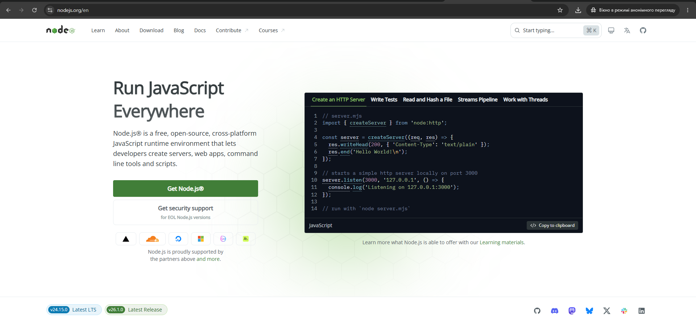

#### 1.3 Встановлення оточення виконання

Код, який ми пишемо в редакторі, є просто текстом. Для того, щоб він перетворився на працюючий застосунок, йому потрібне спеціалізоване середовище, яке зможе інтерпретувати або скомпілювати цей текст і виконати його на рівні процесора.

##### 1.3.1 Загальне поняття оточення виконання (Runtime Environment)

**Runtime Environment (оточення виконання)** — це програмний комплекс, який забезпечує виконання програмного коду під час його роботи. Воно включає в себе не лише сам інтерпретатор чи віртуальну машину, а й набір стандартних бібліотек, менеджер пам'яті та інтерфейси для взаємодії з операційною системою.

Основні складові оточення:

- **Рушій (Engine)** — компонент, що безпосередньо виконує код (наприклад, V8 для JavaScript);
- **Стандартна бібліотека (Standard Library)** — набір готових функцій для роботи з файлами, мережею та даними;
- **API (Application Programming Interface)** — інтерфейси доступу до ресурсів системи.

##### 1.3.2 Змінні середовища (Environment variables) та робота з файлами `.env`

**Змінні середовища** — це динамічні значення, які зберігаються в операційній системі та використовуються програмами для визначення контексту своєї роботи. Найважливішою змінною для розробника є `PATH`, яка містить список шляхів до папок, де система шукає виконувані файли програм.

Особливості роботи з конфігурацією:

- **Змінна PATH** — дозволяє запускати інструменти (наприклад, `node` чи `git`) з будь-якої папки терміналу без вказування повного шляху до файлу;
- **Файли .env** — використовуються для локального зберігання конфіденційних даних (паролі до БД, API-ключі), щоб не "хардкодити" їх у самому коді;
- **Безпека** — файли `.env` ніколи не додаються до системи контролю версій (Git) через файл `.gitignore`.

##### 1.3.3 Встановлення і налаштування оточення виконання Node.js

**Node.js** — це середовище виконання JavaScript, побудоване на рушії Chrome V8, яке дозволяє запускати JS-код поза браузером (на сервері або локальному комп'ютері).

Кроки для встановлення:

- **Офіційний сайт** — перейдіть на [nodejs.org](https://nodejs.org/);
- **Вибір версії** — оберіть версію **LTS (Long Term Support)**, оскільки вона є найбільш стабільною та рекомендованою для навчання;
- **Інсталяція** — завантажте інсталятор для вашої ОС та пройдіть всі кроки, обов'язково залишивши галочку **"Add to PATH"**.

  
Головна сторінка nodejs.org

Для перевірки успішності встановлення введіть у терміналі:

```bash
node -v
```

##### 1.3.4 Встановлення і налаштування оточення виконання PHP

PHP є скриптовою мовою, яка найчастіше використовується для веб-розробки. На відміну від Node.js, PHP часто потребує додаткового веб-сервера (як-от Apache або Nginx) для повноцінної роботи в браузері.

Рекомендації щодо встановлення:

- Для Windows найпростішим способом є використання збірок **XAMPP** або **LocalWP**;
- Для професійної розробки рекомендується встановлювати PHP окремо та вручну додавати шлях до нього у змінні середовища системи.

Перевірка версії:

```bash
php -v
```

##### 1.3.5 Встановлення і налаштування оточення виконання Python

Python є універсальною мовою, яка часто вже встановлена в системах macOS та Linux, але потребує ручного встановлення на Windows.

Важливі нюанси:

- Під час встановлення на Windows **обов'язково** поставте прапорець **"Add Python to PATH"** на першому екрані інсталятора;
- Використовуйте версію 3.x, оскільки підтримка версії 2.x офіційно припинена.

##### 1.3.6 Робота з пакетним менеджером Node.js (npm, yarn, pnpm)

Пакетні менеджери дозволяють завантажувати та керувати сторонніми бібліотеками (залежностями) у вашому проєкті.

Популярні інструменти:

- **npm (Node Package Manager)** — стандартний менеджер, що встановлюється разом із Node.js;
- **yarn** — альтернатива від Meta, відома своєю швидкістю та стабільністю версій;
- **pnpm** — сучасний та дуже швидкий менеджер, який економить місце на диску за рахунок використання жорстких посилань (hard links).

**NVM (Node Version Manager)** — це критично важливий інструмент для Senior розробника. Він дозволяє мати на одному комп'ютері кілька версій Node.js одночасно і перемикатися між ними однією командою. Це необхідно, коли один ваш проєкт працює на старій версії (наприклад, v14), а інший — на найновішій.

##### 1.3.7 Робота з пакетним менеджером PHP (Composer)

**Composer** — це стандарт де-факто для управління залежностями в екосистемі PHP.

Основні принципи:

- Залежності описуються у файлі `composer.json`;
- Всі завантажені бібліотеки зберігаються в папці `vendor/`;
- Для автозавантаження класів використовується файл `vendor/autoload.php`.

Встановлення пакету:

```bash
composer require monolog/monolog
```

##### 1.3.8 Робота з пакетним менеджером Python (pip та venv)

У Python для встановлення пакетів використовується утиліта `pip`.

**Головне правило розробки на Python:** ніколи не встановлюйте пакети глобально. Кожен проєкт повинен мати своє **віртуальне середовище (venv)**. Це ізольована папка, куди встановлюються бібліотеки лише для конкретного завдання, що запобігає конфліктам версій між різними проєктами.

Створення та активація середовища (Windows):

```bash
python -m venv venv
.\venv\Scripts\activate
```

Після активації в терміналі з'явиться префікс `(venv)`, що означає: всі наступні команди `pip install` будуть діяти лише всередині цього проєкту.
