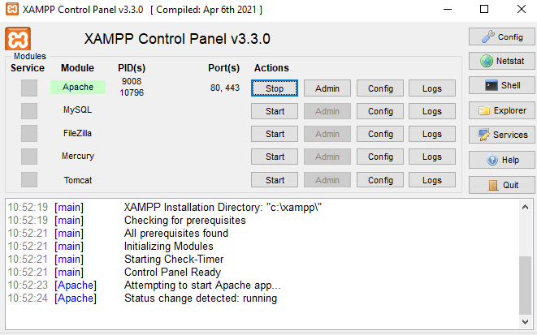

#### 1.4 Встановлення та налаштування веб-сервера

Будь-яка веб-сторінка, яку ви бачите в браузері, була надіслана вам спеціальною програмою — **веб-сервером**. Розуміння того, як працюють ці сервери та як їх налаштовувати, є базовою навичкою для будь-якого Fullstack-розробника.

Веб-сервер виконує дві основні функції:

- **Обробка запитів** — отримання HTTP-запитів від клієнта (браузера) та пошук відповідного ресурсу;
- **Передача вмісту** — відправка HTML-файлів, зображень або результатів роботи скриптів назад клієнту.

##### 1.4.1 Встановлення та налаштування веб-сервера Apache

**Apache HTTP Server** — це один із найстаріших та найпоширеніших веб-серверів у світі. Він відомий своєю гнучкістю, величезною кількістю модулів та простотою налаштування через локальні файли конфігурації.

Ключові особливості:

- **Файли .htaccess** — дозволяють змінювати налаштування сервера (наприклад, робити редиректи) безпосередньо в папці проєкту без перезавантаження всього сервера;
- **Модульність** — підтримка величезної кількості розширень (mod_rewrite для гарних URL, mod_ssl для шифрування тощо);
- **Процесна модель** — кожне нове з'єднання може створювати окремий процес (або потік), що робить його дуже надійним, але менш ефективним при величезних навантаженнях.

Для навчання на Windows найчастіше використовується у складі пакета **XAMPP**. Після запуску панелі керування XAMPP необхідно натиснути кнопку "Start" навпроти модуля Apache.

  
Панель керування XAMPP, модуль Apache підсвічений зеленим кольором, що сигналізує про його успішний запуск на портах 80 та 443

##### 1.4.2 Встановлення та налаштування веб-сервера Nginx

**Nginx** (вимовляється як "Engine-X") — це сучасний високопродуктивний веб-сервер та реверс-проксі. Він був створений як відповідь на обмеження Apache і зараз є стандартом для високонавантажених систем.

Переваги Nginx:

- **Асинхронна архітектура** — використовує подієву модель (event-driven), що дозволяє одному серверу обробляти десятки тисяч одночасних з'єднань при мінімальному споживанні оперативної пам'яті;
- **Реверс-проксі** — часто використовується як "вхідні двері", які приймають запити від користувачів і перенаправляють їх на Node.js, Python чи PHP застосунки;
- **Робота зі статикою** — віддає картинки, CSS та JS-файли значно швидше за конкурентів.

Конфігурація Nginx зазвичай зберігається у файлі `nginx.conf`. Базовий блок налаштування сайту виглядає так:

```nginx
server {
    listen 80;
    server_name localhost;
    root /var/www/html;
    index index.html;
}
```

##### 1.4.3 Встановлення та налаштування веб-сервера Lighttpd

**Lighttpd** (також відомий як "Lighty") — це ще один легкий веб-сервер, спроектований для швидкості, безпеки та дотримання стандартів.

Сфери застосування:

- **Малопотужні пристрої** — ідеально підходить для IoT-систем (наприклад, Raspberry Pi) через наднизьке споживання ресурсів;
- **Висока швидкість FastCGI** — оптимізований для роботи з динамічним контентом через протоколи FastCGI, SCGI та AJP;
- **Безпека** — має меншу кодову базу, ніж Apache, що потенційно зменшує кількість вразливостей.

Хоча Lighttpd менш популярний за Nginx у великому вебі, він залишається чудовим вибором для вузькоспеціалізованих проєктів, де критичним є кожен мегабайт оперативної пам'яті.
