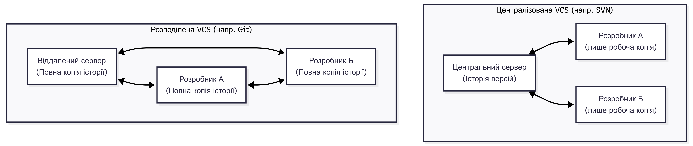

## РОЗДІЛ 2. СИСТЕМА КОНТРОЛЮ ВЕРСІЙ GIT ТА GITHUB

#### 2.1 Загальні відомості про VCS

Уявіть, що ви працюєте над великим проєктом протягом кількох місяців. В один момент ви вносите зміни, які ламають все, що працювало до цього, а кнопка "Undo" в редакторі вже не допомагає. Або ви працюєте в команді з п'ятьма колегами, і вам потрібно одночасно редагувати той самий файл. Саме для вирішення таких завдань і були створені **VCS (Version Control Systems)**.

##### 2.1.1 Поняття системи контролю версій та її роль у розробці ПЗ

**Система контролю версій (VCS)** — це програмне забезпечення, яке фіксує зміни у файлах проєкту протягом часу, дозволяючи вам повертатися до конкретних станів (версій) у будь-який момент.

Роль VCS у сучасному процесі розробки:

- **Історія змін** — ви завжди знаєте, хто, коли і навіщо змінив конкретний рядок коду;
- **Командна робота** — можливість безпечно об'єднувати код від різних розробників в один проєкт;
- **Експерименти** — створення окремих "гілок" для тестування нових ідей без ризику зіпсувати основний стабільний код;
- **Резервне копіювання** — оскільки репозиторій зазвичай зберігається і на сервері, і у розробників, втратити код майже неможливо.

  
Порівняння централізованої та розподіленої систем контролю версій

##### 2.1.2 Огляд Git як розподіленої системи контролю версій

**Git** — це найпопулярніша у світі розподілена система контролю версій, створена Лінусом Торвальдсом у 2005 році для розробки ядра Linux. На відміну від застарілих систем, Git є "розподіленим", що означає: кожен розробник має на своєму комп'ютері **повну копію** всієї історії проєкту, а не лише останню версію файлів.

Ключові переваги Git:

- **Швидкість** — майже всі операції (коміти, перегляд історії, розгалуження) відбуваються локально на вашому диску без звернення до мережі;
- **Надійність** — кожен стан проєкту хешується за допомогою алгоритму SHA-1, що гарантує цілісність даних;
- **Гнучке розгалуження** — створення нової гілки в Git займає частки секунди, що кардинально змініло підхід до розробки функціоналу.

##### 2.1.3 Порівняння хмарних сервісів: GitHub, GitLab, Bitbucket

Хоча Git працює локально, для спільної роботи нам потрібен віддалений сервер, де зберігатиметься "еталонна" копія коду. Такі сервери називають хостингами репозиторіїв.

Основні гравці на ринку:

- **GitHub** — найбільший у світі хостинг, стандарт де-факто для Open Source проєктів. Має найкращу соціальну складову та величезну кількість інтеграцій;
- **GitLab** — потужне рішення, яке часто обирають великі компанії через розвинену вбудовану систему автоматизації (CI/CD) та можливість встановити власну копію сервісу на корпоративні сервери;
- **Bitbucket** — сервіс від компанії Atlassian, який ідеально інтегрується з іншими інструментами керування проєктами, такими як Jira та Confluence.

Важливо розуміти: **Git** — це інструмент (двигун), а **GitHub** — це сервіс (платформа), де цей інструмент використовується для зберігання коду в інтернеті.

| Характеристика           | GitHub                             | GitLab                             | Bitbucket                       |
| :----------------------- | :--------------------------------- | :--------------------------------- | :------------------------------ |
| **Популярність**         | Найвища (стандарт для Open Source) | Висока (корпоративний сектор)      | Середня (бізнес-проєкти)        |
| **CI/CD**                | GitHub Actions (дуже потужний)     | Вбудований GitLab CI (лідер ринку) | Bitbucket Pipelines             |
| **Self-hosting**         | Обмежено (GitHub Enterprise)       | Повноцінно (Community Edition)     | Ні (лише хмара або Data Center) |
| **Фішка**                | Найбільша спільнота у світі        | Все-в-одному (DevSecOps платформа) | Найкраща інтеграція з Jira      |
| **Приватні репозиторії** | Безкоштовно (з обмеженнями)        | Безкоштовно (з обмеженнями)        | Безкоштовно (до 5 користувачів) |
