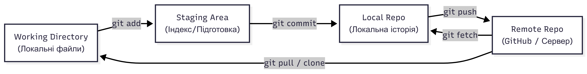

#### 2.3 Життєвий цикл репозиторію та базові команди

Робота з Git будується навколо трьох основних зон: **Working Directory** (ваші файли), **Staging Area** (підготовка до збереження) та **Local Repository** (історія версій). Розуміння того, як файли подорожують між цими зонами, є ключем до опанування Git.

##### 2.3.1 Створення та клонування репозиторію

Щоб почати відстежувати проєкт, у вас є два шляхи:

- **git init** — створює новий порожній репозиторій у поточній папці (з'являється прихована папка `.git`);
- **git clone [url]** — копіює вже існуючий проєкт із віддаленого сервера (наприклад, GitHub) на ваш комп'ютер разом з усією історією його змін.

##### 2.3.2 Робота зі змінами: add, commit, status

Коли ви змінюєте файли, Git бачить ці зміни, але не зберігає їх автоматично. Ви маєте пройти через процес "коміту" (фіксації).

Основні кроки:

1. **git status** — показує стан вашого проєкту (які файли змінено, а які ще не відстежуються);
2. **git add [назва_файлу]** — додає файл до **Staging Area** (індексу). Ви кажете Git: "Я хочу включити ці зміни у наступний пакет збереження";
3. **git commit -m "Опис змін"** — створює запис в історії репозиторію. **Коміт** — це злімок вашого проєкту в конкретний момент часу.

  
Потік даних у Git: Working Directory -> (git add) -> Staging Area -> (git commit) -> Local Repo

##### 2.3.3 Робота з віддаленими серверами: push та pull

Ваш локальний репозиторій зазвичай пов'язаний із віддаленим (remote) репозиторієм на GitHub.

Команди синхронізації:

- **git push origin main** — відправляє ваші локальні коміти на сервер. Тепер ваші колеги зможуть їх побачити;
- **git pull origin main** — завантажує зміни з сервера та автоматично об'єднує їх із вашим локальним кодом. Це дозволяє завжди мати актуальну версію проєкту.

##### 2.3.4 Файл .gitignore: що варто ігнорувати

У проєкті завжди є файли, які **не повинні** потрапляти в історію версій. Для цього використовується спеціальний файл `.gitignore`.

Що зазвичай ігнорують:

- **Залежності** — папки `node_modules/` (JS), `vendor/` (PHP) чи `venv/` (Python) займають багато місця і можуть бути легко відновлені однією командою пакетного менеджера;
- **Тимчасові файли** — кеші браузерів, системні файли ОС (наприклад, `.DS_Store`);
- **Конфігураційні файли з секретами** — файл `.env` з паролями до баз даних.

##### 2.3.5 Безпека секретів та .env.example

Найбільша помилка початківця — випадково відправити на GitHub API-ключ або пароль. Роботи-сканери миттєво знаходять такі дані та використовують їх для зламу ваших ресурсів.

Як робити правильно:

- **Ніколи не комітьте .env** — додайте його в `.gitignore` відразу після створення проєкту;
- **Створюйте .env.example** — це копія вашого `.env`, але без реальних паролів (лише з назвами змінних). Ви додаєте цей файл у Git, щоб ваші колеги знали, які налаштування їм потрібно заповнити локально;
- **Використовуйте шаблони** — багато IDE автоматично підказують, які файли варто додати в ігнорування для конкретної мови програмування.
