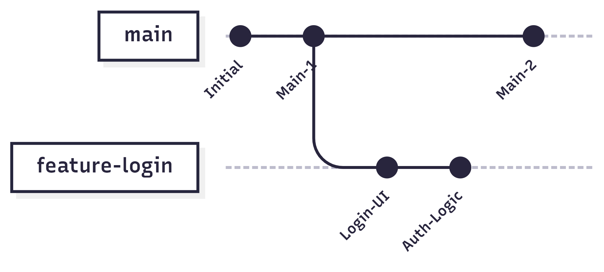

#### 2.4 Стратегії розгалуження (Branching)

Однією з найпотужніших фішок Git є можливість створювати **гілки (branches)**. Це дозволяє команді працювати над різними функціями одночасно, не заважаючи один одному та не ламаючи основний код проєкту.

##### 2.4.1 Робота з гілками: branch та switch

Уявіть, що основна гілка вашого проєкту (зазвичай називається `main` або `master`) — це стовбур дерева. Кожна нова гілка — це відгалуження, де ви можете експериментувати, писати новий код, а потім, якщо все працює добре, повернути ці зміни до стовбура.

Базові операції:

- **git branch [назва]** — створює нову гілку від поточного місця;
- **git switch [назва]** — перемикає вашу робочу директорію на вказану гілку (раніше використовувалась команда `git checkout`);
- **git switch -c [назва]** — створює нову гілку та одразу переходить на неї;
- **git branch -d [назва]** — видаляє гілку після того, як вона стала непотрібною.

  
Схема розгалуження

##### 2.4.2 Злиття гілок та вирішення конфліктів

Коли робота над фічею завершена, її потрібно об'єднати з основною гілкою. Цей процес називається **мердж (merge)**.

Алгоритм дій:

1. Перейдіть у гілку, В ЯКУ ви хочете влити зміни (наприклад, `git switch main`);
2. Виконайте команду `git merge [назва_гілки_з_фічею]`.

**Мердж-конфлікт** виникає, коли ви та ваш колега змінили той самий рядок у тому самому файлі. Git не знає, чию версію залишити, тому він зупиняє процес і просить вас вирішити це вручну.

Як вирішити конфлікт:

- Відкрийте конфліктний файл (IDE підсвітить проблемні місця);
- Оберіть правильний варіант коду або напишіть комбінований;
- Видаліть маркери конфлікту (`<<<<<<<`, `=======`, `>>>>>>>`);
- Збережіть файл, виконайте `git add` та `git commit`.

##### 2.4.3 Базовий Pull Request workflow на GitHub

У професійній розробці зміни рідко вливаються в `main` безпосередньо. Замість цього використовується механізм **Pull Request (PR)**.

Життєвий цикл PR:

- **Push** — ви відправляєте свою локальну гілку на GitHub (`git push origin my-feature`);
- **Open PR** — на сайті GitHub ви натискаєте "Compare & pull request", описуєте свої зміни та просите колег їх переглянути;
- **Code Review** — колеги дивляться ваш код, залишають зауваження або ставлять "Approve";
- **Merge** — після перевірки та проходження всіх тестів, кнопка "Merge pull request" на GitHub вливає ваш код в основну гілку.

Цей підхід гарантує високу якість коду та дозволяє всій команді бути в курсі того, що змінюється в проєкті.
