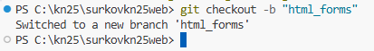
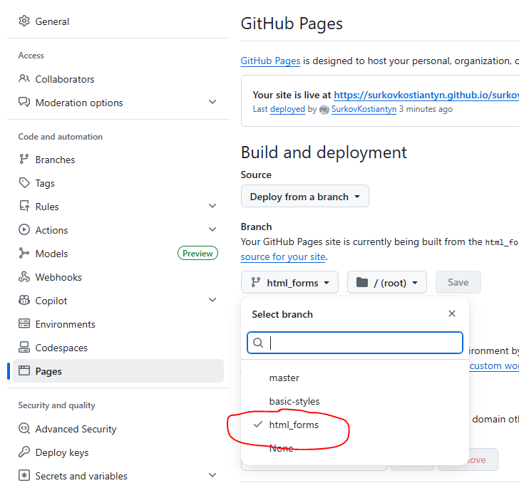

# Лабораторне заняття №6 (2 години). Реалізація складних форм із різними типами вводу.

## Мета

Опанувати створення складних HTML5 форм для збору даних користувача. Застосувати вбудовану валідацію полів та стилізувати форму оформлення замовлення (Checkout) для інтернет-магазину.

## План

1. Створення нової сторінки `checkout.html`.
2. Структурування форми тегами `<fieldset>` та `<legend>`.
3. Використання різних типів `<input>` (text, email, tel, radio, checkbox, date).
4. Застосування вбудованої HTML5 валідаціі (`required`, `pattern`, `minlength`).
5. Стилізація форми та станів валідації (`:valid`, `:invalid`).

## Хід роботи

**Увага:** Продовжуємо роботу над інтернет-магазином "TechShop". Ми створюємо сторінку "Оформлення замовлення", куди користувач потрапить після натискання на кнопку "Кошик".
Якщо ви працюєте над створенням сторінки портфоліо, то необхідно реалізувати сторінки login.html або register.html

Нагадуємо, що на даний момент структура проєкту має бути наступною:

```text
project/
├── assets/
│   ├── css/          - папка з стилями
│   │   ├── form.css  - стилі для форми
│   │   └── style.css - основні стилі
│   ├── img/          - папка з зображеннями
│   │   └── bg.png    - фонове зображення
│   └── js/           - папка з скриптами
├── .gitignore        - файл з ігнорованими файлами
├── index.html        - головна сторінка
└── checkout.html     - сторінка оформлення замовлення (або інша ваша сторінка з формами)
```

У вас мають бути наступні гілки (branches) в репозиторії:

- `master` - в цю гілку залито базовий HTML згідно з першими лабораторними заняттями.
- `basic-styles` - в цю гілку вже додано CSS файли
- `form-styles` - в цій гілці ви виконуєте поточне лабораторне заняття.

1. **Створення сторінки:**
   - Створіть файл `checkout.html` у корені проєкту (поряд з `index.html`).
   - Скопіюйте базову структуру з `index.html` (включно зі стилями, `<header>` та `<footer>`).
   - Очистіть вміст тегу `<main>` — тут буде наша форма.

**Порада**: Якщо у вас вже реалізовано меню навігації, то ви можете дописати в ньому посилання на нову сторінку. Наприклад:

```html
<a href="checkout.html">Оформлення замовлення</a>
```

2. **Структура складної форми:**
   - Усередині `<main>` додайте заголовок `<h2>Оформлення замовлення</h2>`.
   - Створіть тег `<form action="#" method="POST" class="checkout-form">`.
   - Розбийте форму на логічні блоки за допомогою `<fieldset>`:

     _Блок 1: Особисті дані_

     ```html
     <fieldset>
       <legend>1. Особисті дані</legend>
       <div class="form-group">
         <label for="fullName">ПІБ:</label>
         <input
           type="text"
           id="fullName"
           name="fullName"
           required
           placeholder="Іванов Іван Іванович"
         />
       </div>
       <div class="form-group">
         <label for="email">Email:</label>
         <input type="email" id="email" name="email" required />
       </div>
       <div class="form-group">
         <label for="phone">Телефон:</label>
         <!-- Валідація на 10-12 цифр + код країни -->
         <input
           type="tel"
           id="phone"
           name="phone"
           pattern="[\+]\d{2}\d{10}"
           placeholder="+380991234567"
           required
           title="Формат: +380XXXXXXXXX"
         />
       </div>
     </fieldset>
     ```

     _Блок 2: Доставка_

     ```html
     <fieldset>
       <legend>2. Спосіб доставки</legend>
       <div class="form-radio">
         <input
           type="radio"
           id="deliveryNova"
           name="delivery"
           value="nova_poshta"
           checked
         />
         <label for="deliveryNova">Нова Пошта</label>
       </div>
       <div class="form-radio">
         <input
           type="radio"
           id="deliveryCourier"
           name="delivery"
           value="courier"
         />
         <label for="deliveryCourier">Кур'єр за адресою</label>
       </div>

       <div class="form-group">
         <label for="city">Місто:</label>
         <select id="city" name="city">
           <option value="kyiv">Київ</option>
           <option value="lviv">Львів</option>
           <option value="odesa">Одеса</option>
         </select>
       </div>
     </fieldset>
     ```

     _Блок 3: Коментар та згода_
     - Додайте текстове поле `<textarea>` для коментаря до замовлення.
     - Додайте `<input type="checkbox" required>` з текстом "Я погоджуюсь з правилами магазину".
     - Фінальна кнопка: `<button type="submit" class="btn btn-primary">Підтвердити замовлення</button>`.

3. **Стилізація форми (у файл `style.css`):**
   - Зробіть форму акуратною. Уникайте розтягування полів на весь екран:
     ```css
     .checkout-form {
       max-width: 600px;
       margin: 2rem auto; /* Центрування на сторінці */
       background: #fff;
       padding: 2rem;
       border-radius: 8px;
       box-shadow: 0 4px 6px rgba(0, 0, 0, 0.1);
     }
     fieldset {
       border: 1px solid #e5e7eb;
       padding: 1rem;
       margin-bottom: 1.5rem;
       border-radius: 4px;
     }
     .form-group {
       display: flex;
       flex-direction: column;
       margin-bottom: 1rem;
     }
     .form-group input,
     .form-group select,
     .form-group textarea {
       padding: 0.5rem;
       border: 1px solid #d1d5db;
       border-radius: 4px;
       font-family: inherit;
     }
     ```

4. **Візуальний зворотний зв'язок (Validation CSS):**
   - Додайте стилі для псевдокласів, щоб підсвічувати правильні і неправильні поля (зеленим/червоним):

   ```css
   .form-group input:invalid:focus {
     border-color: red;
     outline: none;
   }
   .form-group input:valid {
     border-color: green;
   }
   ```

   **Порада**: Ви можете створити окремий файл `form.css` для стилів форми і підключити його до вашої сторінки з формами.

5. **Збереження (Commit & Push):**
   - Перевірте роботу форми: натисніть кнопку відправки, не заповнивши ПІБ або ввівши неправильний формат телефону. Браузер повинен заблокувати відправку і показати спливаючу підказку.
   - Виконайте `git add .` та `git commit -m "Create checkout form with HTML5 validation"`.
   - **Важливо**: запушіть зміни в нову гілку `html_forms`.

**Приклад виконання консольної команди:**



**Сайти з порадами:**

1. [Як створити правильну форму на сайті: 20 правил створення](https://iprospect.com.ua/yak-stvoriti-pravilnu-formu-na-sajti-20-pravil-stvorennya/)
2. [Best practices for forms on the website](https://hostpro.ua/blog/ua/best-practices-for-forms-on-the-website/)

## Результат

В вашому проєкті з'явиться нова повноцінна сторінка з семантичною, багатомодульною формою замовлення, яка візуально реагує на введення правильних/неправильних даних без жодного рядка JavaScript.
Для того, щоб побачити цю сторінку в Github Pages потрібно буде обрати гілку `html_forms` в налаштуваннях репозиторію (Settings -> Pages -> Source) та натиснути "Save". Після цього потрібно буде почекати деякий час, щоб сторінка оновилася.



## Контрольні питання

1. Навіщо обгортати поля форми у тег `<fieldset>` і давати заголовок через `<legend>`?
2. Яка різниця між типами інпутів `radio` та `checkbox`? Чому всі інпути типу `radio` в одній групі повинні мати однаковий атрибут `name`?
3. Що робить компонент браузера з формою, якщо на інпуті стоїть атрибут `required`, а користувач натиснув `Submit` порожнім?
4. Для чого потрібен атрибут `for` у тегу `<label>` і чому він повинен співпадати з атрибутом `id` інпута?
5. Як працюють псевдокласи CSS `:valid` та `:invalid`? В який момент вони застосовуються до поля?
