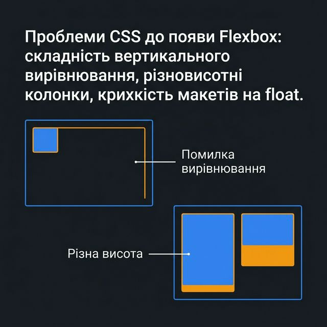
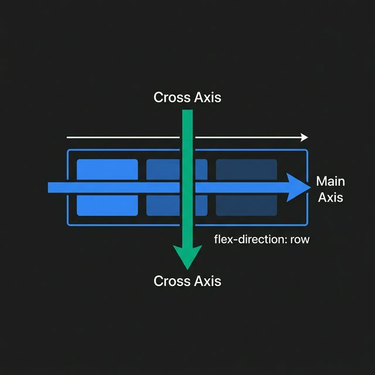
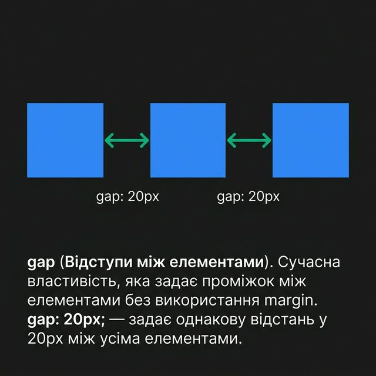
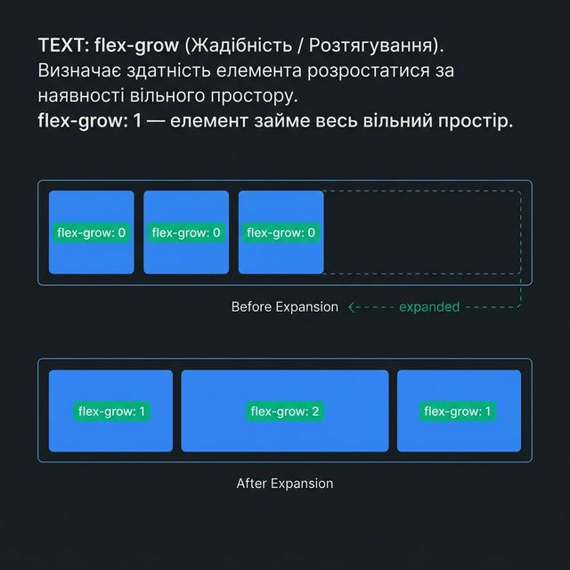
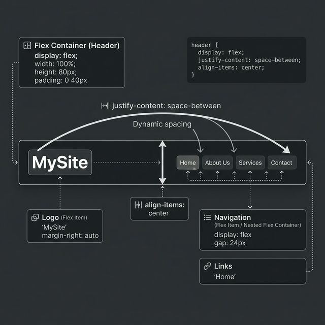

# Лекція №4 (2 години). Сучасні Layout-технології: Flexbox.

## План лекції

1. Вступ до макетування та проблеми класичних підходів.
2. Концепція Flexbox (Flexible Box Layout).
3. Властивості Flex-контейнера (Flex Container).
4. Властивості Flex-елементів (Flex Items).
5. Вирівнювання та розподіл простору.
6. Практичні приклади використання Flexbox.

## Перелік умовних скорочень

- **CSS** (Cascading Style Sheets) — каскадні таблиці стилів.
- **W3C** (World Wide Web Consortium) — консорціум Всесвітнього павутиння.
- **UI** (User Interface) — інтерфейс користувача.
- **Responsive Design** — адаптивний веб-дизайн.

## Вступ

До появи сучасних систем компонування (layout), розробники веб-інтерфейсів були змушені використовувати інструменти, які для цього не призначалися. Таблиці (`<table>`), ефекти обтікання (`float`), і властивості `position` та `display: inline-block` — все це були лише спроби обійти обмеження CSS. Вони супроводжувалися безліччю "хаків" та складнощами з підтримкою коду.

Особливо складно було вирішувати базові задачі: вертикальне центрування елемента невідомої висоти, рівномірний розподіл вільного простору між елементами, або зміна порядку візуального відображення елементів незалежно від їхнього порядку в HTML-коді.

Ситуація докорінно змінилася зі стандартизацією модуля **Flexible Box Layout (Flexbox)**. Flexbox забезпечив ефективніший спосіб компонування, вирівнювання і розподілу простору між елементами в контейнері, навіть якщо їхній розмір невідомий або динамічний. Flexbox є одновимірною системою макетування (працює або з рядком, або з колонкою), і на сьогодні це базовий, обов'язковий інструмент кожного фронтенд-розробника.

## 1. Вступ до макетування та проблеми класичних підходів

Історично склалося так, що HTML створювався для відображення текстових документів, а не складних застосунків.
Основні проблеми "класичного" макетування (до Flexbox/Grid):



- **Складність вертикального вирівнювання.** До появи Flexbox надійного способу центрувати елемент по вертикалі (без використання таблиць або точного позиціювання з `transform`) майже не існувало.

- **Неможливість легко створити колонки однакової висоти.** Якщо два `float`-блоки знаходилися поруч, а контенту в одному було більше, інший блок був коротшим, що ламало фонове оформлення.
- **Крихкість макетів.** `float`-елементи часто "випадали" з батьківських контейнерів, що вимагало використання хаків на кшталт `clearfix`.

Flexbox вирішив ці проблеми елегантно і суто на рівні CSS.

## 2. Концепція Flexbox (Flexible Box Layout)

Flexbox — це не одна властивість, а цілий набір властивостей CSS (модуль). Деякі з них застосовуються до батьківського елемента (який стає **Flex-контейнером**), а інші — до його дочірніх елементів (**Flex-елементів**).

Основна ідея Flexbox полягає в тому, що контейнер може змінювати ширину/висоту та порядок своїх нащадків для найкращого заповнення доступного простору. Як випливає з назви, гнучкий макет дозволяє елементам розтягуватися, щоб заповнити вільне місце, або стискатися, щоб уникнути переповнення.

### Вісь і напрямок

Flexbox побудований навколо концепції двох осей:

- **Головна вісь (Main Axis):** уздовж неї розташовуються flex-елементи. За замовчуванням це горизонтальна лінія (зліва направо).
- **Поперечна вісь (Cross Axis):** перпендикулярна до головної осі. Якщо головна вісь горизонтальна, поперечна буде вертикальною (зверху вниз).



Всі властивості Flexbox працюють відносно цих двох осей. Якщо змінити напрямок головної осі на вертикальний, всі правила вирівнювання повернуться на 90 градусів.


## 3. Властивості Flex-контейнера (Flex Container)

Щоб почати використовувати Flexbox, необхідно задати батьківському елементу властивість `display: flex` (або `inline-flex`). Це ініціалізує гнучкий контекст для всіх його безпосередніх дітей.

```css
.container {
  display: flex; /* Створює flex-контейнер */
}
```

### 3.1. flex-direction (Напрямок головної осі)

Ця властивість визначає, як елементи розташовуватимуться всередині контейнера.

- `row` (за замовчуванням): елементи розташовуються зліва направо (для ltr мов).
- `row-reverse`: елементи розташовуються справа наліво.
- `column`: елементи розташовуються зверху вниз (головна вісь стає вертикальною).
- `column-reverse`: елементи розташовуються знизу вгору.

### 3.2. flex-wrap (Перенесення елементів)

За замовчуванням flex-елементи будуть намагатися вміститися в один рядок, навіть якщо для цього їх доведеться стиснути.

- `nowrap` (за замовчуванням): всі елементи в одному рядку.
- `wrap`: якщо елементи не поміщаються, вони переносяться на новий рядок (вниз).
- `wrap-reverse`: перенесення на новий рядок відбувається догори.

_Скорочення `flex-flow`:_ об'єднує `flex-direction` та `flex-wrap`. Приклад: `flex-flow: row wrap;`

### 3.3. justify-content (Вирівнювання по головній осі)

Ця властивість дуже важлива — вона визначає, як розподіляється вільний простір **вздовж головної осі** (за замовчуванням — по горизонталі).

- `flex-start` (за замовчуванням): елементи притискаються до початку осі.
- `flex-end`: елементи притискаються до кінця осі.
- `center`: елементи центруються.
- `space-between`: перший елемент на початку, останній в кінці, а решта вільного простору розподіляється рівномірно між елементами.
- `space-around`: рівномірний простір навколо кожного елемента (відстань між елементами буде вдвічі більшою, ніж відстань від країв контейнера).
- `space-evenly`: простір рівномірно розподіляється так, щоб відстань між будь-якими двома елементами і краями була абсолютно однаковою.

### 3.4. align-items (Вирівнювання по поперечній осі)

Визначає поведінку вирівнювання елементів **вздовж поперечної осі** (за замовчуванням — по вертикалі).

- `stretch` (за замовчуванням): елементи розтягуються, щоб заповнити контейнер по висоті (створює колонки однакової висоти!).
- `flex-start`: притискаються до початку поперечної осі (догори).
- `flex-end`: притискаються до кінця поперечної осі (донизу).
- `center`: центруються по поперечній осі (ідеальне вертикальне центрування!).
- `baseline`: вирівнюються по базовій лінії тексту.

### 3.5. align-content (Вирівнювання рядків)

Працює **тільки** якщо є кілька рядків flex-елементів (тобто задано `flex-wrap: wrap`). Вирівнює цілі рядки вздовж поперечної осі (аналогічно як `justify-content` працює для окремих елементів).

Значення: `flex-start`, `flex-end`, `center`, `space-between`, `space-around`, `stretch`.

### 3.6. gap (Відступи між елементами)

Сучасна властивість, яка задає проміжок між елементами без використання `margin`.
`gap: 20px;` — задає однакову відстань у 20px між усіма елементами. (Можна використовувати `row-gap` та `column-gap`).




## 4. Властивості Flex-елементів (Flex Items)

Ці властивості застосовуються не до контейнера, а до його дочірніх блоків.

### 4.1. order (Порядок)

За замовчуванням елементи відображаються в тому порядку, в якому вони написані в HTML (`order: 0`). Властивість дозволяє змінювати візуальний порядок елементів без зміни HTML. Може приймати від'ємні значення (наприклад, `order: -1` перемістить елемент на початок).

### 4.2. flex-grow (Жадібність / Розтягування)

Визначає здатність елемента розростатися за наявності вільного простору. Приймає безрозмірне число (пропорцію).

- `flex-grow: 0` (за замовчуванням) — елемент не розтягується.
- `flex-grow: 1` — елемент займе весь вільний простір. Якщо всім елементам задати `1`, вони розділять спільний простір порівну. Якщо одному задати `2`, а іншим `1`, то перший спробує зайняти вдвічі більше вільного простору.




### 4.3. flex-shrink (Стискання)

Визначає здатність елемента стискатися, якщо місця не вистачає.

- `flex-shrink: 1` (за замовчуванням) — елемент може стискатися.
- `flex-shrink: 0` — елемент ніколи не стиснеться менше, ніж значення його базису (`flex-basis` або `width`), навіть якщо викличе переповнення (overflow).

### 4.4. flex-basis (Базовий розмір)

Задає початковий розмір елемента перед тим, як вільний простір буде розподілено. Це як `width` (або `height` у колонковій розкладці), але з вищим пріоритетом. Значення за замовчуванням: `auto`.

_Скорочення `flex`:_ об'єднує `grow`, `shrink` та `basis`. Рекомендується використовувати його.
Приклади:
`flex: 1;` (те саме що `flex: 1 1 0%;`) — розтягнись на все вільне місце.
`flex: 0 0 200px;` — будь рівно 200px, не стискайся і не розтягуйся.

### 4.5. align-self (Індивідуальне вирівнювання)

Дозволяє перевизначити властивість `align-items` контейнера для одного конкретного елемента.
Значення ті самі: `auto`, `flex-start`, `flex-end`, `center`, `baseline`, `stretch`.

## 5. Вирівнювання та розподіл простору

Flexbox дозволяє легко реалізувати макети, які раніше були надзвичайно складними.

### Ідеальне центрування по горизонталі та вертикалі

Найпростіший спосіб центрувати будь-який об'єкт (наприклад, модальне вікно або іконку) всередині блоку:

```css
.container {
  display: flex;
  justify-content: center; /* Центрування по горизонталі */
  align-items: center; /* Центрування по вертикалі */
  height: 100vh; /* На всю висоту екрану */
}
```

## 6. Практичні приклади використання Flexbox

### Приклад 1: Панель навігації (Header)

Класична задача: логотип зліва, меню справа.

```html
<header class="header">
  <div class="logo">MySite</div>
  <nav class="nav">
    <a href="#">Головна</a>
    <a href="#">Про нас</a>
  </nav>
</header>
```

```css
.header {
  display: flex;
  justify-content: space-between; /* Лого зліва, меню справа */
  align-items: center; /* Центруємо по вертикалі */
  padding: 20px;
  background: #333;
  color: white;
}
.nav {
  display: flex;
  gap: 15px; /* Замість margin для посилань */
}
```




### Приклад 2: Картки товарів (Grid-подібний макет)

```css
.product-list {
  display: flex;
  flex-wrap: wrap; /* Дозволяємо перенесення */
  gap: 20px;
}
.product-card {
  flex: 1 1 300px; /* Гнучка картка: росте, стискається, базова ширина 300px */
}
```

## Висновки

1. Flexbox — це революційний крок у розвитку CSS, створений спеціально для макетування інтерфейсів.
2. Система завжди має Контейнер (Parent) та Елементи (Children). Їм призначені різні набори CSS-властивостей.
3. Основа Flexbox — це поняття головної та поперечної осей. Управління вирівнюванням та розподілом простору відбувається вздовж них.
4. Властивості `justify-content` та `align-items` — головні інструменти для розташування елементів.
5. За допомогою властивостей flex-елементів (`grow`, `shrink`, `basis`) реалізується гнучкість макета — здатність адаптуватися до різних розмірів екрану.

## Джерела

1. [A Complete Guide to Flexbox (CSS-Tricks)](https://css-tricks.com/snippets/css/a-guide-to-flexbox/)
   _(Де-факто, найзручніший візуальний довідник з Flexbox у світі)_
2. [MDN Web Docs: Basic concepts of flexbox](https://developer.mozilla.org/en-US/docs/Web/CSS/CSS_Flexible_Box_Layout/Basic_Concepts_of_Flexbox)
3. [Flexbox Froggy](https://flexboxfroggy.com/ru/) - інтерактивна гра для вивчення Flexbox.

## Запитання для самоперевірки

1. У чому принципова відмінність макетування на базі Flexbox від підходів із використанням `float`?
2. Яку властивість необхідно додати контейнеру (батьку), щоб розпочати роботу з Flexbox?
3. Де знаходиться Головна (Main) і Поперечна (Cross) осі, якщо задано `flex-direction: column`?
4. Яка властивість контейнера відповідає за обгортання елементів на новий рядок, якщо вони не вміщуються по ширині?
5. Як центрирувати елемент всередині Flex-контейнера одночасно по горизонталі та вертикалі?
6. Чим `justify-content` відрізняється від `align-items`?
7. Що означають три значення у властивості-скороченні `flex: 1 0 auto`?
8. Як впливає властивість `order` на позиціонування елементів? З якого значення починається нумерація?
