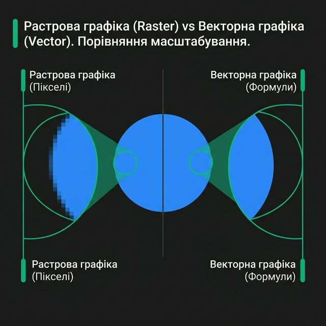
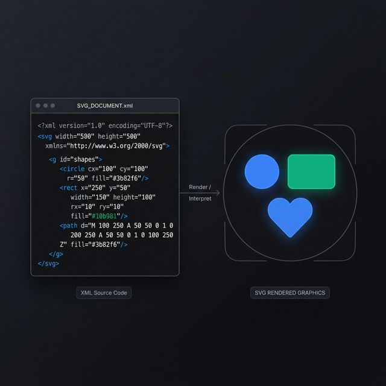

# Лекція №7 (2 години). Оптимізація графіки та продуктивність верстки.

## План лекції

1. Важливість оптимізації продуктивності (Web Performance).
2. Формати веб-графіки: Растр vs Вектор.
3. Сучасні формати зображень (WebP, AVIF).
4. Оптимізація SVG-графіки.
5. Адаптивні зображення: елемент `<picture>` та атрибут `srcset`.
6. Ліниве завантаження (Lazy Loading).
7. Оптимізація CSS: критичний шлях рендерингу (Critical Rendering Path).
8. Lorem ipsum в графіці.

## Перелік умовних скорочень

- **SVG** (Scalable Vector Graphics) — масштабована векторна графіка.
- **JPEG** (Joint Photographic Experts Group) — популярний формат стиснення растрових зображень (з втратами).
- **PNG** (Portable Network Graphics) — формат стиснення растрових зображень без втрат якості (підтримує прозорість).
- **GIF** (Graphics Interchange Format) — формат графічного обміну (історичний формат для анімацій).
- **LCP** (Largest Contentful Paint) — метрика Core Web Vitals, час відмальовки найбільшого елемента контенту.
- **CLS** (Cumulative Layout Shift) — метрика Core Web Vitals, ступінь зсуву макета під час завантаження.
- **CSSOM** (CSS Object Model) — об'єктна модель CSS.
- **DOM** (Document Object Model) — об'єктна модель документа.

## Вступ

Згідно з дослідженнями Google, якщо час завантаження мобільної сторінки збільшується з 1 до 3 секунд, ймовірність того, що користувач залишить сайт (bounce rate), зростає на 32%. Якщо до 5 секунд — на 90%. Сучасні користувачі не люблять чекати.

Окрім того, продуктивність сайту є одним із ключових факторів ранжування в пошукових системах. У 2021 році Google офіційно впровадив метрики **Web Vitals** (здоров'я сайту) як сигнал для SEO.

Найважчими елементами будь-якої веб-сторінки зазвичай є зображення (вони можуть складати до 60-70% ваги всієї сторінки). Тому правильна робота з графікою — це перший і найважливіший крок до створення швидкого сайту без "гальм". Окрім графіки, критично важливо розуміти, як браузер читає HTML і CSS, щоб не блокувати відмальовку першого екрану (First Paint).

Мета цієї лекції — розібратися з сучасними форматами графіки, способами її доставки та основами продуктивності на етапі верстки.

## 1. Формати веб-графіки: Растр vs Вектор

Вся графіка в інтернеті поділяється на дві принципові категорії, які мають різні сфери застосування:

**Растрова графіка:**



- Будується з пікселів (крапок), що утворюють сітку.

- Зі збільшенням розміру (масштабуванням) **втрачає якість** — з'являються "квадратики" (пікселізація) і розмитість.
- Формати: JPEG, PNG, GIF, WebP, AVIF.
- **Використання:** Фотографії, складні ілюстрації з градієнтами та тінями.

**Векторна графіка:**

- Будується за допомогою математичних формул (координати точок, криві Безьє, багатокутники).
- Масштабується нескінченно без **жодної втрати якості**. Одна й та сама іконка може важити 2 Кб як на екрані годинника, так і на білборді.
- Формат у вебі єдиний: SVG.
- **Використання:** Логотипи, іконки інтерфейсу, прості векторні ілюстрації, графіки. Ніколи не використовуйте для фотографій (це неможливо або призведе до астрономічного розміру файлу).

## 2. Сучасні растрові формати (WebP, AVIF)

Два історичних "кити" веб-графіки тривалий час домінували в Інтернеті:

- **JPEG (.jpg):** Найкраще підходить для фотогалерей. Використовує стиснення з втратами (відкидає частину кольорової інформації, яку не фіксує людське око).
- **PNG (.png):** Використовує стиснення без втрат, але його головна фішка — підтримка "альфа-каналу" (прозорості). Файли виходять значно важчими за JPEG на складних картинках.

Сьогодні ці формати вважаються "застарілими" з точки зору продуктивності. На їх зміну прийшли формати нового покоління:

- **WebP (.webp):** Розроблений Google. Забезпечує стиснення на 25-35% краще за JPEG при ідентичній візуальній якості. Підтримує і прозорість (як PNG), і анімацію (як GIF). Сьогодні WebP вважається де-факто стандартом веб-розробки.
- **AVIF (.avif):** Найсучасніший формат (заснований на відеокодеку AV1). Він забезпечує ще краще стиснення, ніж WebP (в середньому на 20% легше за WebP і до 50% легше за JPEG). Основний недолік — повільне кодування та підтримка старими браузерами.

> **Що таке системи збірки (Build Tools) та навіщо вони потрібні?**
>
> Сучасна веб-розробка розділена на два основні етапи: **розробка (Development)** та **публікація (Production)**. 
> 
> Під час розробки ви пишете код так, щоб він був зручним для людини: розбиваєте на багато файлів, додаєте коментарі, використовуєте зрозумілі назви змінних. Але для браузера такий "людський" код є надлишковим і повільним.
>
> **Системи збірки (наприклад, Vite, Webpack, Parcel)** — це інструменти, які автоматично трансформують ваш робочий код у фінальну, максимально оптимізовану версію для кінцевого користувача.
>
> **Основні завдання систем збірки:**
> 1.  **Image Optimization:** Автоматичне стиснення зображень та їх конвертація у WebP/AVIF без втручання розробника.
> 2.  **Minification:** Видалення всіх зайвих символів (пробілів, коментарів) для зменшення ваги файлів.
> 3.  **Bundling & Concatenation:** Об'єднання багатьох дрібних CSS/JS файлів у один (або декілька) бандлів для мінімізації кількості HTTP-запитів.
> 4.  **Hot Module Replacement (HMR):** Миттєве відображення змін у браузері при збереженні файлу, що значно прискорює написання коду.
>
> Для навчальних проектів на першому курсі найкращим вибором є **Vite**. Він дозволяє зосередитися на верстці, автоматично виконуючи всю "брудну" роботу з оптимізації за лаштунками.


## 3. Оптимізація SVG-графіки

**SVG** — це XML-документ. За лаштунками векторна картинка є просто текстовим кодом, який схожий на HTML:




```html
<!-- 1. Коло (Circle) -->
<svg width="60" height="60">
  <circle cx="30" cy="30" r="25" fill="#3b82f6" />
</svg>

<!-- 2. Прямокутник (Rectangle) -->
<svg width="100" height="60">
  <rect width="100" height="60" rx="10" fill="#10b981" />
</svg>

<!-- 3. Лінія (Line) -->
<svg width="100" height="60">
  <line x1="0" y1="0" x2="100" y2="60" stroke="#f59e0b" stroke-width="5" />
</svg>

<!-- 4. Текст (Text) -->
<svg width="150" height="60">
  <text x="10" y="40" font-family="Arial" font-size="30" fill="white">SVG Text</text>
</svg>

<!-- 5. Складний шлях (Path) - так будуються іконки -->
<svg width="60" height="60" viewBox="0 0 24 24" fill="none" stroke="red" stroke-width="2">
  <path d="M12 21.35l-1.45-1.32C5.4 15.36 2 12.28 2 8.5 2 5.42 4.42 3 7.5 3c1.74 0 3.41.81 4.5 2.09C13.09 3.81 14.76 3 16.5 3 19.58 3 22 5.42 22 8.5c0 3.78-3.4 6.86-8.55 11.54L12 21.35z" />
</svg>
```


Оскільки це текст, у нього є унікальні переваги:

1. **Стилізація через CSS:** Ви можете змінювати колір SVG-іконки при наведенні миші (`:hover`), використовуючи звичайні CSS властивості `fill` (колір заливки) та `stroke` (колір лінії).
2. **Анімація:** SVG можна анімувати як через CSS (плавне обертання або зміна кольору), так і складніше за допомогою JavaScript.

**Правила оптимізації SVG:**

- Експорт із графічних редакторів (Figma/Illustrator) часто додає багато сміття до коду SVG (коментарі, пусті групи `<g>`, зайві метадані програми).
- Обов'язково пропускайте SVG через оптимізатори (наприклад, **SVGO** або веб-сервіс **SVGOMG**). Це може зменшити вагу іконки на 50-70%.
- Для набору дрібних іконок використовуйте векторні спрайти (SVG Sprite).

## 4. Адаптивні зображення: елемент `<picture>` та атрибут `srcset`

Якщо у вас на сайті великий банер "Герой", на моніторі комп'ютера (ширина понад 1920px) вам потрібна картинка розміром 2-3 Мегабайти. Якщо користувач зайде з iPhone SE (ширина 375px), відправляти йому таку важку картинку — це "вбивство" його мобільного трафіку та заряду батареї (картинку все одно буде стиснуто стилем `max-width: 100%`).

Одразу кілька картинок різного розміру дає нам атрибут `srcset` у тегу ``:

```html

```

Тут ми розповідаємо браузеру: "Ось тобі три картинки різної ширини (400, 800 і 1600 пікселів). Самостійно визнач розмір екрану і завантаж лише ту НАЙМЕНШУ, якої буде достатньо для чіткого відображення".

**Елемент `<picture>`: Підміна формату (Art Direction або Фоллбеки)**

Якщо ж потрібно відобразити сучасний `.avif` для нових браузерів і `.webp` або `.jpeg` для застарілих (браузер завантажить перший формат який підтримує).

```html
<picture>
  <!-- Якщо браузер підтримує AVIF - беремо це -->
  <source type="image/avif" srcset="photo.avif" />
  <!-- Якщо ні, але підтримує WebP - берем це -->
  <source type="image/webp" srcset="photo.webp" />
  <!-- Ні те, ні інше: беремо класичний JPEG як запасний варіант (fallback) -->
  
</picture>
```

## 5. Ліниве завантаження (Lazy Loading)

Якщо на сторінці 20 великих зображень товарів, користувачу не обов'язково завантажувати їх усі відразу, особливо якщо 18 з них знаходяться нижче лінії екрану і до них ще треба доскролити.

**Ліниве завантаження (Lazy Loading)** відкладає завантаження невидимих у порті перегляду зображень до моменту, поки користувач не прокрутить сторінку до них. Це **кардинально** зменшує час першого завантаження сайту.

Раніше це робилося за допомогою складних JavaScript бібліотек (або Intersection Observer API). Зараз ми маємо вбудований у стандарти HTML атрибут `loading="lazy"`.

```html
<!-- Картинка почне завантажуватися лише коли наблизиться до екрану -->


<!-- Eager - (за замовчуванням) завантажити негайно. 
     Критично для логотипів та картинок на першому екрані (Hero Image)! -->

```

## 6. Захист від стрибків макета (Cumulative Layout Shift)

Один із найгірших патернів поведінки сайту: ви читаєте текст, а через секунду завантажується картинка і текст раптово "з'їжджає" вниз, або ви взагалі випадково клікаєте на рекламу через цей зсув. Це метрика від Google — Cumulative Layout Shift (CLS).

**Причина:** Браузер не знає висоти зображення, доки не почне його завантажувати і не прочитає його метадані.
**Рішення:** Завжди, **завжди** вказуйте атрибути `width` та `height` безпосередньо у HTML-тегу ``. Вони створюють потрібну пропорцію. Коли CSS застосує `width: 100%`, браузер збереже цю пропорцію і зарезервує пустий простір під картинку до того, як вона завантажиться. Зсуву не буде!

```html
<!-- Правильно! -->

```

## 7. Оптимізація CSS: критичний шлях рендерингу (CRP)

**Критичний шлях рендерингу (Critical Rendering Path)** — це послідовність кроків, які браузер виконує для перетворення HTML, CSS та JavaScript в пікселі на екрані:

1. Завантаження HTML і побудова DOM.
2. Завантаження CSS і побудова CSSOM (ресурс, блокуючий рендерінг!).
3. Об'єднання DOM і CSSOM в Дерево рендерингу (Render Tree).
4. Layout (Обчислення геометрії і позицій на екрані).
5. Paint (Малювання пікселів шарів).

**Головне правило:** CSS за замовчуванням блокує відмальовку усієї сторінки (Render-blocking). Браузер покаже користувачу лише "білий екран смерті", доки повністю не завантажить і не розпарсить файл `styles.css`.

**Як оптимізувати стилі:**

**Методи оптимізації CSS:**

1.  **Мініфікація (Minification):** Процес видалення всіх зайвих символів (пробіли, коментарі, переноси) без зміни логіки коду.
    *   **До (зручно для розробки):**
        ```css
        .header {
          margin: 10px;
          color: white; /* Основний колір */
        }
        ```
    *   **Після (для браузера):**
        ```css
        .header{margin:10px;color:#fff}
        ```
    Це зменшує розмір файлу на 20-30%. Файли зазвичай мають розширення `.min.css`.

2.  **Об'єднання та Бандлінг (Bundling):** Замість 10 маленьких CSS-файлів (модулів), інструменти зборки (Vite, Webpack) об'єднують їх в один великий файл. Це критично, бо кожен окремий файл — це окремий HTTP-запит, який змушує браузер чекати.
    > **Майте на увазі:** Старий метод `@import "file.css"` всередині CSS-файлів вважається поганою практикою (Bad Practice), бо він завантажує файли послідовно, один за одним, що значно сповільнює сайт.

3.  **Критичний CSS (Critical CSS):** Це техніка, при якій стилі для першого екрана (Hero section, навігація) вставляються безпосередньо в `<head>` документа всередині тегу `<style>`. Решта стилів завантажується асинхронно пізніше. Це дозволяє користувачу побачити контент миттєво.

4.  **Видалення невикористаного коду (PurgeCSS):** Часто бібліотеки (наприклад, Bootstrap або Tailwind) містять тисячі рядків коду, з яких ви використовуєте лише 5%. Спеціальні утиліти автоматично аналізують ваш HTML і видаляють із фінального CSS-файлу все, що не задіяно на сторінках.

5.  **Стиснення на сервері (Gzip / Brotli):** Сервер перед відправкою "архівує" текстові файли CSS. Браузер їх розпаковує. Це може зменшити об'єм даних, що передаються мережею, у 3-5 разів.

## 8. Lorem ipsum в графіці (Сервіси-заповнювачі)

Під час розробки прототипу сайту часто немає готових фотографій чи іконок від дизайнера. Щоб не витрачати час на пошук реальних картинок, розробники використовують "генератори-заповнювачі" (Placeholders), які працюють за принципом тексту Lorem Ipsum.

**Популярні сервіси:**

1.  **Lorem Picsum (Растрова графіка):**
    Найпопулярніший сервіс для випадкових фотографій. Дозволяє задати потрібний розмір, розмиття або чорно-білий фільтр прямо в URL.
    *   **Приклад:** `https://picsum.photos/800/600` (випадкове фото 800x600).
    *   **Використання:** ``

2.  **Placehold.co (Векторні/Технічні заповнювачі):**
    Генерує прості кольорові блоки з текстом розміру всередині. Дуже зручно для розмітки сітки, коли важливо бачити межі блоків.
    *   **Приклад:** `https://placehold.co/600x400?text=Banner+Ad`
    *   **Перевага:** Можна вибрати формат SVG для ідеальної чіткості.

3.  **RoboHash / Pravatar (Аватари):**
    Для прототипів списків користувачів чи коментарів.
    *   **RoboHash:** `https://robohash.org/antigravity` (генерує унікального робота на основі будь-якого тексту).
    *   **Pravatar:** `https://i.pravatar.cc/150?u=fakeid` (реалістичні обличчя людей).

4.  **Font Awesome / Lucide (Іконки):**
    Для іконок інтерфейсу найкраще використовувати готові бібліотеки через CDN (Content Delivery Network).
    ```html
    <!-- Приклад підключення Lucide іконок для швидкого прототипування -->
    <script src="https://unpkg.com/lucide@latest"></script>
    <i data-lucide="shopping-cart"></i>
    <script>lucide.createIcons();</script>
    ```

> **Порада:** Використовуйте ці сервіси лише на етапі розробки. Для фінальної версії сайту (Production) всі картинки мають бути оптимізовані та зберігатися безпосередньо на вашому сервері або в надійній хмарній мережі (CDN).

## Висновки

1. Продуктивність (Performance) — це базова властивість хорошого продукту та необхідна умова успішного SEO-оптимізації.
2. Обирайте WebP та AVIF для растрової графіки замість JPEG та PNG.
3. Для ілюстрацій, іконок та логотипів використовуйте виключно SVG. Не забувайте оптимізувати його код зовнішніми інструментами.
4. Елемент `<picture>` та атрибут `srcset` дозволяють подавати різні розміри та формати зображень для різних пристроїв (Smart Crop та Format Fallbacking).
5. Атрибут `loading="lazy"` суттєво заощаджує ресурси, завантажуючи графіку лише тоді, коли вона потрапляє в поле зору.
6. Явне вказування `width` і `height` у розмітці `` запобігає негативним зсувам макета (зводить метрику CLS до нуля).
7. CSS є рисурсом, що блокує рендерінг, тому файли стилів потрібно мініфікувати.

## Джерела

1.  [MDN Web Docs: Responsive images](https://developer.mozilla.org/en-US/docs/Learn/HTML/Multimedia_and_embedding/Responsive_images)
2.  [Google Developers: Optimize Web Vitals](https://web.dev/vitals/)
3.  [Squoosh App (Google)](https://squoosh.app/) - найкращий онлайн-конвертер та оптимізатор для картинок.
4.  [SVGOMG](https://jakearchibald.github.io/svgomg/) - інтерфейс для інструмента оптимізації SVGO.

## Запитання для самоперевірки

1. Чим растрова графіка онцептуально відрізняється від векторної (SVG)? Де варто використовувати кожну з них?
2. Які переваги пропонують формати WebP або AVIF порівняно із JPEG і PNG?
3. Що таке "Ліниве завантаження" (Lazy Loading) і як його реалізувати стандартними засобами HTML? Чому його не можна застосовувати для всіх зображень на сайті?
4. Навіщо потрібно вказувати атрибути `width` та `height` для тегу ``? Як це впливає на метрику CLS (стабільність макета)?
5. Що таке атрибут `srcset` і яка його головна роль (для мобільних телефонів vs великих дисплеїв)?
6. Які проблеми вирішує елемент `<picture>` з дочірніми `<source>` (назвіть мінімум дві причини використання)?
7. Що означає термін "ресурс, блокуючий рендерінг" і чому CSS вважається саме таким ресурсом? Як мініфікація допомагає вирішити цю проблему?
